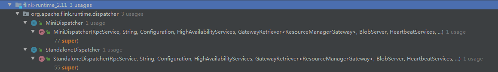

# Flink job 提交到运行的过程


[TOC]

从TypeInformation的用法中我们看到了Transformation, StreamGraph, 在追踪过程中看到了一些job提交的逻辑，我们再来详细追一下这个过程，以及后面job是怎么运行起来的


## Client端(env.execute)

- StreamExecutionEnvironment.java

  这是我们我们熟悉的job代码里都会用到的job提交的起点


```java
public JobExecutionResult execute(String jobName) throws Exception {
		Preconditions.checkNotNull(jobName, "Streaming Job name should not be null.");
		//获取StreamGraph，执行execute
		return execute(getStreamGraph(jobName));
	}
```

 看看这个`execute`方法， 是一个抽象方法，在子类中实现

```java
public abstract JobExecutionResult execute(StreamGraph streamGraph) throws Exception;
```

我们知道远程提交的时候是通过`createRemoteEnvironment` 方法获得env的，那么来看看它是如何创建的

```java
public static StreamExecutionEnvironment createRemoteEnvironment(
			String host, int port, String... jarFiles) {
    //返回了一个RemoteStreamEnvironment
		return new RemoteStreamEnvironment(host, port, jarFiles);
	}
```

显然刚刚的`execute`方法在`RemoteStreamEnvironment`中实现， 

step in

- RemoteStreamEnvironment.java


```java
public JobExecutionResult execute(StreamGraph streamGraph) throws Exception {
		transformations.clear();   
		return executeRemotely(streamGraph, jarFiles);
}

protected JobExecutionResult executeRemotely(StreamGraph streamGraph, List<URL> jarFiles) throws ProgramInvocationException {
		return executeRemotely(streamGraph,
			this.getClass().getClassLoader(),
			getConfig(),
			jarFiles,
			host,
			port,
			clientConfiguration,
			globalClasspaths,
			savepointRestoreSettings);
}

//execute最终调用这个方法
private static JobExecutionResult executeRemotely(StreamGraph streamGraph,
		ClassLoader envClassLoader,
		ExecutionConfig executionConfig,
		List<URL> jarFiles,
		String host,
		int port,
		Configuration clientConfiguration,
		List<URL> globalClasspaths,
		SavepointRestoreSettings savepointRestoreSettings
	) throws ProgramInvocationException {
		if (LOG.isInfoEnabled()) {
			LOG.info("Running remotely at {}:{}", host, port);
		}

		ClassLoader userCodeClassLoader = JobWithJars.buildUserCodeClassLoader(jarFiles, globalClasspaths, envClassLoader);

		Configuration configuration = new Configuration();
		configuration.addAll(clientConfiguration);

		configuration.setString(JobManagerOptions.ADDRESS, host);
		configuration.setInteger(JobManagerOptions.PORT, port);

		configuration.setInteger(RestOptions.PORT, port);

		final ClusterClient<?> client;
		try {
			//新建一个RestClusterClient
			client = new RestClusterClient<>(configuration, "RemoteStreamEnvironment");
		}
		catch (Exception e) {
			throw new ProgramInvocationException("Cannot establish connection to JobManager: " + e.getMessage(),
				streamGraph.getJobGraph().getJobID(), e);
		}

		client.setPrintStatusDuringExecution(executionConfig.isSysoutLoggingEnabled());

		if (savepointRestoreSettings == null) {
			savepointRestoreSettings = SavepointRestoreSettings.none();
		}

		try {
			//最终运行run方法
			return client.run(streamGraph, jarFiles, globalClasspaths, userCodeClassLoader, savepointRestoreSettings)
				.getJobExecutionResult();
		}
		catch (ProgramInvocationException e) {
			throw e;
		}
		catch (Exception e) {
			String term = e.getMessage() == null ? "." : (": " + e.getMessage());
			throw new ProgramInvocationException("The program execution failed" + term,
				streamGraph.getJobGraph().getJobID(), e);
		}
		finally {
			try {
				client.shutdown();
			} catch (Exception e) {
				LOG.warn("Could not properly shut down the cluster client.", e);
			}
		}
	}
```


我们看到实际是在`RestClusterClient`的run方法中提交


step in

- ClusterClient.java

```java
public JobSubmissionResult run(FlinkPlan compiledPlan,
			List<URL> libraries, List<URL> classpaths, ClassLoader classLoader, SavepointRestoreSettings savepointSettings)
			throws ProgramInvocationException {
    	//获取JobGraph
		JobGraph job = getJobGraph(flinkConfig, compiledPlan, libraries, classpaths, savepointSettings);
        //在这里提交
		return submitJob(job, classLoader);
	}
```


step in

是一个抽象方法，在子类中实现

```java
public abstract JobSubmissionResult submitJob(JobGraph jobGraph, ClassLoader classLoader)
		throws ProgramInvocationException;
```

我们知道刚刚用到的是`RestClusterClient`, 那就是说用的是这个类中的实现


step in

- RestClusterClient.java


```java
public JobSubmissionResult submitJob(JobGraph jobGraph, ClassLoader classLoader) throws ProgramInvocationException {
		log.info("Submitting job {} (detached: {}).", jobGraph.getJobID(), isDetached());
		//这里提交job
		final CompletableFuture<JobSubmissionResult> jobSubmissionFuture = submitJob(jobGraph);

		if (isDetached()) {
			try {
               	//获取提交结果
				return jobSubmissionFuture.get();
			} catch (Exception e) {
				throw new ProgramInvocationException("Could not submit job",
					jobGraph.getJobID(), ExceptionUtils.stripExecutionException(e));
			}
		} else {
			final CompletableFuture<JobResult> jobResultFuture = jobSubmissionFuture.thenCompose(
				ignored -> requestJobResult(jobGraph.getJobID()));

			final JobResult jobResult;
			try {
                //获取提交结果并等待获取job执行结果，这里应该会block到job执行结束，后面再仔细看看
				jobResult = jobResultFuture.get();
			} catch (Exception e) {
				throw new ProgramInvocationException("Could not retrieve the execution result.",
					jobGraph.getJobID(), ExceptionUtils.stripExecutionException(e));
			}

			try {
				this.lastJobExecutionResult = jobResult.toJobExecutionResult(classLoader);
				return lastJobExecutionResult;
			} catch (JobExecutionException e) {
				throw new ProgramInvocationException("Job failed.", jobGraph.getJobID(), e);
			} catch (IOException | ClassNotFoundException e) {
				throw new ProgramInvocationException("Job failed.", jobGraph.getJobID(), e);
			}
		}
	}

```


step in `submitJob`方法，看看做了些啥

```java
public CompletableFuture<JobSubmissionResult> submitJob(@Nonnull JobGraph jobGraph) {
		// we have to enable queued scheduling because slot will be allocated lazily
		jobGraph.setAllowQueuedScheduling(true);

    	// 1. 把jobGraph写到临时文件，异步执行
		CompletableFuture<java.nio.file.Path> jobGraphFileFuture = CompletableFuture.supplyAsync(() -> {
			try {
               
				final java.nio.file.Path jobGraphFile = Files.createTempFile("flink-jobgraph", ".bin");
				try (ObjectOutputStream objectOut = new ObjectOutputStream(Files.newOutputStream(jobGraphFile))) {
					objectOut.writeObject(jobGraph);
				}
return jobGraphFile;
			} catch (IOException e) {
				throw new CompletionException(new FlinkException("Failed to serialize JobGraph.", e));
			}
		}, executorService);
		//2. 1完成后，将jobgraph和要上传的本地jar包名称写入requestbody， 同时返回文件路径
		CompletableFuture<Tuple2<JobSubmitRequestBody, Collection<FileUpload>>> requestFuture = jobGraphFileFuture.thenApply(jobGraphFile -> {
			List<String> jarFileNames = new ArrayList<>(8);
			List<JobSubmitRequestBody.DistributedCacheFile> artifactFileNames = new ArrayList<>(8);
			Collection<FileUpload> filesToUpload = new ArrayList<>(8);

			filesToUpload.add(new FileUpload(jobGraphFile, RestConstants.CONTENT_TYPE_BINARY));

			for (Path jar : jobGraph.getUserJars()) {
				jarFileNames.add(jar.getName());
				filesToUpload.add(new FileUpload(Paths.get(jar.toUri()), RestConstants.CONTENT_TYPE_JAR));
			}

			for (Map.Entry<String, DistributedCache.DistributedCacheEntry> artifacts : jobGraph.getUserArtifacts().entrySet()) {
				artifactFileNames.add(new JobSubmitRequestBody.DistributedCacheFile(artifacts.getKey(), new Path(artifacts.getValue().filePath).getName()));
				filesToUpload.add(new FileUpload(Paths.get(artifacts.getValue().filePath), RestConstants.CONTENT_TYPE_BINARY));
			}

			final JobSubmitRequestBody requestBody = new JobSubmitRequestBody(
				jobGraphFile.getFileName().toString(),
				jarFileNames,
				artifactFileNames);

			return Tuple2.of(requestBody, Collections.unmodifiableCollection(filesToUpload));
		});
		//3. 2完成后发送request， 这里会做文件上传
		final CompletableFuture<JobSubmitResponseBody> submissionFuture = requestFuture.thenCompose(
			requestAndFileUploads -> sendRetriableRequest(
				JobSubmitHeaders.getInstance(),
				EmptyMessageParameters.getInstance(),
				requestAndFileUploads.f0,
				requestAndFileUploads.f1,
				isConnectionProblemOrServiceUnavailable())
		);
		//4. 1和3完成后删除jobGraph临时文件
		submissionFuture
			.thenCombine(jobGraphFileFuture, (ignored, jobGraphFile) -> jobGraphFile)
			.thenAccept(jobGraphFile -> {
			try {
				Files.delete(jobGraphFile);
			} catch (IOException e) {
				log.warn("Could not delete temporary file {}.", jobGraphFile, e);
			}
		});
		//5. 获取从3返回的responsebody，返回提交结果
		return submissionFuture
			.thenApply(
				(JobSubmitResponseBody jobSubmitResponseBody) -> new JobSubmissionResult(jobGraph.getJobID()))
			.exceptionally(
				(Throwable throwable) -> {
					throw new CompletionException(new JobSubmissionException(jobGraph.getJobID(), "Failed to submit JobGraph.", ExceptionUtils.stripCompletionException(throwable)));
				});
	}
```


到这里，客户端就向Flink提交了一个job

## Cluster端

### Flink 如何处理submit请求

从各个发送submit请求的地方找找线索

 ```java
final CompletableFuture<JobSubmitResponseBody> submissionFuture = requestFuture.thenCompose(
			requestAndFileUploads -> sendRetriableRequest(
				JobSubmitHeaders.getInstance(),
				EmptyMessageParameters.getInstance(),
				requestAndFileUploads.f0,
				requestAndFileUploads.f1,
				isConnectionProblemOrServiceUnavailable())
		);
 ```

我们看到一个`JobSubmitHeaders`，看看它是什么

- JobSubmitHeaders.java

它是一个单例， 定义了url是"/jobs"，request类型是JobSubmitRequestBody，response类型是JobSubmitResponseBody

```java
public class JobSubmitHeaders implements MessageHeaders<JobSubmitRequestBody, JobSubmitResponseBody, EmptyMessageParameters> {

	private static final String URL = "/jobs";
	private static final JobSubmitHeaders INSTANCE = new JobSubmitHeaders();

	private JobSubmitHeaders() {
	}

	@Override
	public Class<JobSubmitRequestBody> getRequestClass() {
		return JobSubmitRequestBody.class;
	}

	@Override
	public HttpMethodWrapper getHttpMethod() {
		return HttpMethodWrapper.POST;
	}

	@Override
	public String getTargetRestEndpointURL() {
		return URL;
	}

	@Override
	public Class<JobSubmitResponseBody> getResponseClass() {
		return JobSubmitResponseBody.class;
	}

	@Override
	public HttpResponseStatus getResponseStatusCode() {
		return HttpResponseStatus.ACCEPTED;
	}

	@Override
	public EmptyMessageParameters getUnresolvedMessageParameters() {
		return EmptyMessageParameters.getInstance();
	}

	public static JobSubmitHeaders getInstance() {
		return INSTANCE;
	}

	@Override
	public String getDescription() {
		return "Submits a job. This call is primarily intended to be used by the Flink client. This call expects a " +
			"multipart/form-data request that consists of file uploads for the serialized JobGraph, jars and " +
			"distributed cache artifacts and an attribute named \"" + FileUploadHandler.HTTP_ATTRIBUTE_REQUEST + "\" for " +
			"the JSON payload.";
	}

	@Override
	public boolean acceptsFileUploads() {
		return true;
	}
}
```


来看看这个类的引用


有一个`JobSubmitHandler`看起来就是我们要的

它有一个`handleRequest`方法，正是处理submit请求的地方

```java
protected CompletableFuture<JobSubmitResponseBody> handleRequest(@Nonnull HandlerRequest<JobSubmitRequestBody, EmptyMessageParameters> request, @Nonnull DispatcherGateway gateway) throws RestHandlerException {
		final Collection<File> uploadedFiles = request.getUploadedFiles();
		final Map<String, Path> nameToFile = uploadedFiles.stream().collect(Collectors.toMap(
			File::getName,
			Path::fromLocalFile
		));

		if (uploadedFiles.size() != nameToFile.size()) {
			throw new RestHandlerException(
				String.format("The number of uploaded files was %s than the expected count. Expected: %s Actual %s",
					uploadedFiles.size() < nameToFile.size() ? "lower" : "higher",
					nameToFile.size(),
					uploadedFiles.size()),
				HttpResponseStatus.BAD_REQUEST
			);
		}

		final JobSubmitRequestBody requestBody = request.getRequestBody();

		if (requestBody.jobGraphFileName == null) {
			throw new RestHandlerException(
				String.format("The %s field must not be omitted or be null.",
					JobSubmitRequestBody.FIELD_NAME_JOB_GRAPH),
				HttpResponseStatus.BAD_REQUEST);
		}
		//这里获取jobGraph
		CompletableFuture<JobGraph> jobGraphFuture = loadJobGraph(requestBody, nameToFile);

		Collection<Path> jarFiles = getJarFilesToUpload(requestBody.jarFileNames, nameToFile);

		Collection<Tuple2<String, Path>> artifacts = getArtifactFilesToUpload(requestBody.artifactFileNames, nameToFile);

		CompletableFuture<JobGraph> finalizedJobGraphFuture = uploadJobGraphFiles(gateway, jobGraphFuture, jarFiles, artifacts, configuration);
		//获取到jobGraph之后调用gateway的submitJob方法
		CompletableFuture<Acknowledge> jobSubmissionFuture = finalizedJobGraphFuture.thenCompose(jobGraph -> gateway.submitJob(jobGraph, timeout));

		return jobSubmissionFuture.thenCombine(jobGraphFuture,
			(ack, jobGraph) -> new JobSubmitResponseBody("/jobs/" + jobGraph.getJobID()));
	}
```

我们来看看这个getway是什么

```java
protected CompletableFuture<JobSubmitResponseBody> handleRequest(@Nonnull HandlerRequest<JobSubmitRequestBody, EmptyMessageParameters> request, @Nonnull DispatcherGateway gateway) throws RestHandlerException
```

可以看到它是`DispatcherGateway`在`handleRequest`作为参数传进来的，我们看看它的`submitJob`方法

- DispatcherGateway.java

```java
CompletableFuture<Acknowledge> submitJob(
		JobGraph jobGraph,
		@RpcTimeout Time timeout);
```

发现它是一个接口的抽象方法， 这个接口有下面几种实现


刚刚的getway是怎么传进来的，这里不仔细研究，也是一个很长的故事，后面再仔细看一下

我们分别看看`MiniDispatcher` 和`StandaloneDispatcher`，还有他们的`submitJob`方法

- StandaloneDispatcher.java

```java
//类定义
public class StandaloneDispatcher extends Dispatcher
//没有实现submitJob方法
```

- MiniDispatcher.java

```java
//类定义
public class MiniDispatcher extends Dispatcher

//submitJob方法
public CompletableFuture<Acknowledge> submitJob(JobGraph jobGraph, Time timeout) {
		//调用父类方法
		final CompletableFuture<Acknowledge> acknowledgeCompletableFuture = super.submitJob(jobGraph, timeout);
		//出错处理
		acknowledgeCompletableFuture.whenComplete(
			(Acknowledge ignored, Throwable throwable) -> {
				if (throwable != null) {
					onFatalError(new FlinkException(
						"Failed to submit job " + jobGraph.getJobID() + " in job mode.",
						throwable));
				}
			});

		return acknowledgeCompletableFuture;
	}

```


我们发现这两个类都继承`Dispatcher`并且`submitJob`方法都使用了父类的实现，我们去`Dispatcher`看看他的`submitJob`方法


```java
public CompletableFuture<Acknowledge> submitJob(JobGraph jobGraph, Time timeout) {
		log.info("Received JobGraph submission {} ({}).", jobGraph.getJobID(), jobGraph.getName());

		try {
			if (isDuplicateJob(jobGraph.getJobID())) {
				return FutureUtils.completedExceptionally(
					new JobSubmissionException(jobGraph.getJobID(), "Job has already been submitted."));
			} else if (isPartialResourceConfigured(jobGraph)) {
				return FutureUtils.completedExceptionally(
					new JobSubmissionException(jobGraph.getJobID(), "Currently jobs is not supported if parts of the vertices have " +
							"resources configured. The limitation will be removed in future versions."));
			} else {
                //在这里提交
				return internalSubmitJob(jobGraph);
			}
		} catch (FlinkException e) {
			return FutureUtils.completedExceptionally(e);
		}
	}
```


step in

 ```java
private CompletableFuture<Acknowledge> internalSubmitJob(JobGraph jobGraph) {
		log.info("Submitting job {} ({}).", jobGraph.getJobID(), jobGraph.getName());
		//在这里提交
		final CompletableFuture<Acknowledge> persistAndRunFuture = waitForTerminatingJobManager(jobGraph.getJobID(), jobGraph, this::persistAndRunJob)
			.thenApply(ignored -> Acknowledge.get());

		return persistAndRunFuture.handleAsync((acknowledge, throwable) -> {
			if (throwable != null) {
				cleanUpJobData(jobGraph.getJobID(), true);

				final Throwable strippedThrowable = ExceptionUtils.stripCompletionException(throwable);
				log.error("Failed to submit job {}.", jobGraph.getJobID(), strippedThrowable);
				throw new CompletionException(
					new JobSubmissionException(jobGraph.getJobID(), "Failed to submit job.", strippedThrowable));
			} else {
				return acknowledge;
			}
		}, getRpcService().getExecutor());
	}

 ```

step in

```java
private CompletableFuture<Void> waitForTerminatingJobManager(JobID jobId, JobGraph jobGraph, FunctionWithException<JobGraph, CompletableFuture<Void>, ?> action) {
    	//检查有没有相同id的job正在运行，有的话抛出异常
		final CompletableFuture<Void> jobManagerTerminationFuture = getJobTerminationFuture(jobId)
			.exceptionally((Throwable throwable) -> {
				throw new CompletionException(
					new DispatcherException(
						String.format("Termination of previous JobManager for job %s failed. Cannot submit job under the same job id.", jobId),
						throwable)); });

		return jobManagerTerminationFuture.thenComposeAsync(
			FunctionUtils.uncheckedFunction((ignored) -> {
				jobManagerTerminationFutures.remove(jobId);
                //这里提交
				return action.apply(jobGraph);
			}),
			getMainThreadExecutor());
	}
```

这个`action`就是之前传入的`persistAndRunJob`方法，我们进去看看

```java
	private CompletableFuture<Void> persistAndRunJob(JobGraph jobGraph) throws Exception {
		submittedJobGraphStore.putJobGraph(new SubmittedJobGraph(jobGraph));
		//这里好像是要运行job了
		final CompletableFuture<Void> runJobFuture = runJob(jobGraph);

		return runJobFuture.whenComplete(BiConsumerWithException.unchecked((Object ignored, Throwable throwable) -> {
			if (throwable != null) {
				submittedJobGraphStore.removeJobGraph(jobGraph.getJobID());
			}
		}));
	}
```

step in

```java
private CompletableFuture<Void> runJob(JobGraph jobGraph) {
		Preconditions.checkState(!jobManagerRunnerFutures.containsKey(jobGraph.getJobID()));
		//貌似在这里运行
		final CompletableFuture<JobManagerRunner> jobManagerRunnerFuture = createJobManagerRunner(jobGraph);

		jobManagerRunnerFutures.put(jobGraph.getJobID(), jobManagerRunnerFuture);

		return jobManagerRunnerFuture
			.thenApply(FunctionUtils.nullFn())
			.whenCompleteAsync(
				(ignored, throwable) -> {
					if (throwable != null) {
						jobManagerRunnerFutures.remove(jobGraph.getJobID());
					}
				},
				getMainThreadExecutor());
	}
```

step in

```java
	private CompletableFuture<JobManagerRunner> createJobManagerRunner(JobGraph jobGraph) {
		final RpcService rpcService = getRpcService();

		final CompletableFuture<JobManagerRunner> jobManagerRunnerFuture = CompletableFuture.supplyAsync(
			CheckedSupplier.unchecked(() ->
                //创建JobManagerRunner
				jobManagerRunnerFactory.createJobManagerRunner(
					jobGraph,
					configuration,
					rpcService,
					highAvailabilityServices,
					heartbeatServices,
					jobManagerSharedServices,
					new DefaultJobManagerJobMetricGroupFactory(jobManagerMetricGroup),
					fatalErrorHandler)),
			rpcService.getExecutor());
		//创建好runner后调用startJobManagerRunner
		return jobManagerRunnerFuture.thenApply(FunctionUtils.uncheckedFunction(this::startJobManagerRunner));
	}
```

step in `startJobManagerRunner`

```java
	private JobManagerRunner startJobManagerRunner(JobManagerRunner jobManagerRunner) throws Exception {
		final JobID jobId = jobManagerRunner.getJobGraph().getJobID();

		FutureUtils.assertNoException(
            //获取job执行结果
			jobManagerRunner.getResultFuture().handleAsync(
				(ArchivedExecutionGraph archivedExecutionGraph, Throwable throwable) -> {
					// check if we are still the active JobManagerRunner by checking the identity
					final CompletableFuture<JobManagerRunner> jobManagerRunnerFuture = jobManagerRunnerFutures.get(jobId);
					final JobManagerRunner currentJobManagerRunner = jobManagerRunnerFuture != null ? jobManagerRunnerFuture.getNow(null) : null;
					//noinspection ObjectEquality
					if (jobManagerRunner == currentJobManagerRunner) {
						if (archivedExecutionGraph != null) {
                            //确认job结束了
							jobReachedGloballyTerminalState(archivedExecutionGraph);
						} else {
							final Throwable strippedThrowable = ExceptionUtils.stripCompletionException(throwable);

							if (strippedThrowable instanceof JobNotFinishedException) {
								jobNotFinished(jobId);
							} else {
								jobMasterFailed(jobId, strippedThrowable);
							}
						}
					} else {
						log.debug("There is a newer JobManagerRunner for the job {}.", jobId);
					}

					return null;
				}, getMainThreadExecutor()));
		//运行runner
		jobManagerRunner.start();

		return jobManagerRunner;
	}
```

先看看`start` 做了些什么

- JobManagerRunner.java

```java
public void start() throws Exception {
		try {
			leaderElectionService.start(this);
		} catch (Exception e) {
			log.error("Could not start the JobManager because the leader election service did not start.", e);
			throw new Exception("Could not start the leader election service.", e);
		}
	}
```

好像看不出什么，在回过头看看`getResultFuture`

```java
public CompletableFuture<ArchivedExecutionGraph> getResultFuture() {
		return resultFuture;
	}
```

这里的`resultFuture`到底是什么，我们查一下

好像也看不出什么

回头再看看`start` ， `leaderElectionService.start`做了什么

- LeaderElectionService.java

```java
void start(LeaderContender contender) throws Exception;
```

是个接口方法， 看看有哪些实现


不知道用了哪个，都有可能

那我们看看`leaderElectionService` 哪里来的


```java
JobManagerRunner(
			final JobGraph jobGraph,
			final JobMasterServiceFactory jobMasterFactory,
			final HighAvailabilityServices haServices,
			final LibraryCacheManager libraryCacheManager,
			final Executor executor,
			final FatalErrorHandler fatalErrorHandler) throws Exception {

		this.resultFuture = new CompletableFuture<>();
		this.terminationFuture = new CompletableFuture<>();
		this.leadershipOperation = CompletableFuture.completedFuture(null);

		// make sure we cleanly shut down out JobManager services if initialization fails
		try {
			this.jobGraph = checkNotNull(jobGraph);
			this.libraryCacheManager = checkNotNull(libraryCacheManager);
			this.executor = checkNotNull(executor);
			this.fatalErrorHandler = checkNotNull(fatalErrorHandler);

			checkArgument(jobGraph.getNumberOfVertices() > 0, "The given job is empty");

			// libraries and class loader first
			try {
				libraryCacheManager.registerJob(
						jobGraph.getJobID(), jobGraph.getUserJarBlobKeys(), jobGraph.getClasspaths());
			} catch (IOException e) {
				throw new Exception("Cannot set up the user code libraries: " + e.getMessage(), e);
			}

			final ClassLoader userCodeLoader = libraryCacheManager.getClassLoader(jobGraph.getJobID());
			if (userCodeLoader == null) {
				throw new Exception("The user code class loader could not be initialized.");
			}

			// high availability services next
			this.runningJobsRegistry = haServices.getRunningJobsRegistry();
            //在这里得到, haServices是传进来的
			this.leaderElectionService = haServices.getJobManagerLeaderElectionService(jobGraph.getJobID());

			this.leaderGatewayFuture = new CompletableFuture<>();

			// now start the JobManager
			this.jobMasterService = jobMasterFactory.createJobMasterService(jobGraph, this, userCodeLoader);
		}
		catch (Throwable t) {
			terminationFuture.completeExceptionally(t);
			resultFuture.completeExceptionally(t);

			throw new JobExecutionException(jobGraph.getJobID(), "Could not set up JobManager", t);
		}
```


step out

```java
public Dispatcher(
			RpcService rpcService,
			String endpointId,
			Configuration configuration,
			HighAvailabilityServices highAvailabilityServices,
			SubmittedJobGraphStore submittedJobGraphStore,
			GatewayRetriever<ResourceManagerGateway> resourceManagerGatewayRetriever,
			BlobServer blobServer,
			HeartbeatServices heartbeatServices,
			JobManagerMetricGroup jobManagerMetricGroup,
			@Nullable String metricServiceQueryAddress,
			ArchivedExecutionGraphStore archivedExecutionGraphStore,
			JobManagerRunnerFactory jobManagerRunnerFactory,
			FatalErrorHandler fatalErrorHandler,
			HistoryServerArchivist historyServerArchivist) throws Exception {
		super(rpcService, endpointId);

		this.configuration = Preconditions.checkNotNull(configuration);
    	//这里拿的
		this.highAvailabilityServices = Preconditions.checkNotNull(highAvailabilityServices);
		this.resourceManagerGatewayRetriever = Preconditions.checkNotNull(resourceManagerGatewayRetriever);
		this.heartbeatServices = Preconditions.checkNotNull(heartbeatServices);
		this.blobServer = Preconditions.checkNotNull(blobServer);
		this.fatalErrorHandler = Preconditions.checkNotNull(fatalErrorHandler);
		this.submittedJobGraphStore = Preconditions.checkNotNull(submittedJobGraphStore);
		this.jobManagerMetricGroup = Preconditions.checkNotNull(jobManagerMetricGroup);
		this.metricServiceQueryAddress = metricServiceQueryAddress;

		this.jobManagerSharedServices = JobManagerSharedServices.fromConfiguration(
			configuration,
			this.blobServer);

		this.runningJobsRegistry = highAvailabilityServices.getRunningJobsRegistry();

		jobManagerRunnerFutures = new HashMap<>(16);

		leaderElectionService = highAvailabilityServices.getDispatcherLeaderElectionService();

		this.historyServerArchivist = Preconditions.checkNotNull(historyServerArchivist);

		this.archivedExecutionGraphStore = Preconditions.checkNotNull(archivedExecutionGraphStore);

		this.jobManagerRunnerFactory = Preconditions.checkNotNull(jobManagerRunnerFactory);

		this.jobManagerTerminationFutures = new HashMap<>(2);
	}
```


step out



又有两个地方用到了，就是刚刚的`MiniDispatcher` 和`StandaloneDispatcher`

先看看`StandaloneDispatcher`

```java
public StandaloneDispatcher(
			RpcService rpcService,
			String endpointId,
			Configuration configuration,
    		//还是外面传进来的
			HighAvailabilityServices highAvailabilityServices,
			GatewayRetriever<ResourceManagerGateway> resourceManagerGatewayRetriever,
			BlobServer blobServer,
			HeartbeatServices heartbeatServices,
			JobManagerMetricGroup jobManagerMetricGroup,
			@Nullable String metricQueryServiceAddress,
			ArchivedExecutionGraphStore archivedExecutionGraphStore,
			JobManagerRunnerFactory jobManagerRunnerFactory,
			FatalErrorHandler fatalErrorHandler,
			HistoryServerArchivist historyServerArchivist) throws Exception {
		super(
			rpcService,
			endpointId,
			configuration,
			highAvailabilityServices,
			highAvailabilityServices.getSubmittedJobGraphStore(),
			resourceManagerGatewayRetriever,
			blobServer,
			heartbeatServices,
			jobManagerMetricGroup,
			metricQueryServiceAddress,
			archivedExecutionGraphStore,
			jobManagerRunnerFactory,
			fatalErrorHandler,
			historyServerArchivist);
	}
```


继续还是有两个地方


继续，先看第1个

- SessionDispatcherFactory.java

```java
public Dispatcher createDispatcher(
				Configuration configuration,
				RpcService rpcService,
    			//还是外面传的
				HighAvailabilityServices highAvailabilityServices,
				GatewayRetriever<ResourceManagerGateway> resourceManagerGatewayRetriever,
				BlobServer blobServer,
				HeartbeatServices heartbeatServices,
				JobManagerMetricGroup jobManagerMetricGroup,
				@Nullable String metricQueryServiceAddress,
				ArchivedExecutionGraphStore archivedExecutionGraphStore,
				FatalErrorHandler fatalErrorHandler,
				HistoryServerArchivist historyServerArchivist) throws Exception {
		// create the default dispatcher
		return new StandaloneDispatcher(
			rpcService,
			getEndpointId(),
			configuration,
			highAvailabilityServices,
			resourceManagerGatewayRetriever,
			blobServer,
			heartbeatServices,
			jobManagerMetricGroup,
			metricQueryServiceAddress,
			archivedExecutionGraphStore,
			DefaultJobManagerRunnerFactory.INSTANCE,
			fatalErrorHandler,
			historyServerArchivist);
	}
```

继续

- AbstractDispatcherResourceManagerComponentFactory.java

```java
public DispatcherResourceManagerComponent<T> create(
			Configuration configuration,
			RpcService rpcService,
    		//还是外面的
			HighAvailabilityServices highAvailabilityServices,
			BlobServer blobServer,
			HeartbeatServices heartbeatServices,
			MetricRegistry metricRegistry,
			ArchivedExecutionGraphStore archivedExecutionGraphStore,
			MetricQueryServiceRetriever metricQueryServiceRetriever,
			FatalErrorHandler fatalErrorHandler) throws Exception {

		LeaderRetrievalService dispatcherLeaderRetrievalService = null;
		LeaderRetrievalService resourceManagerRetrievalService = null;
		WebMonitorEndpoint<U> webMonitorEndpoint = null;
		ResourceManager<?> resourceManager = null;
		JobManagerMetricGroup jobManagerMetricGroup = null;
		T dispatcher = null;

		try {
			dispatcherLeaderRetrievalService = highAvailabilityServices.getDispatcherLeaderRetriever();

			resourceManagerRetrievalService = highAvailabilityServices.getResourceManagerLeaderRetriever();

			final LeaderGatewayRetriever<DispatcherGateway> dispatcherGatewayRetriever = new RpcGatewayRetriever<>(
				rpcService,
				DispatcherGateway.class,
				DispatcherId::fromUuid,
				10,
				Time.milliseconds(50L));

			final LeaderGatewayRetriever<ResourceManagerGateway> resourceManagerGatewayRetriever = new RpcGatewayRetriever<>(
				rpcService,
				ResourceManagerGateway.class,
				ResourceManagerId::fromUuid,
				10,
				Time.milliseconds(50L));

			final ExecutorService executor = WebMonitorEndpoint.createExecutorService(
				configuration.getInteger(RestOptions.SERVER_NUM_THREADS),
				configuration.getInteger(RestOptions.SERVER_THREAD_PRIORITY),
				"DispatcherRestEndpoint");

			final long updateInterval = configuration.getLong(MetricOptions.METRIC_FETCHER_UPDATE_INTERVAL);
			final MetricFetcher metricFetcher = updateInterval == 0
				? VoidMetricFetcher.INSTANCE
				: MetricFetcherImpl.fromConfiguration(
					configuration,
					metricQueryServiceRetriever,
					dispatcherGatewayRetriever,
					executor);

			webMonitorEndpoint = restEndpointFactory.createRestEndpoint(
				configuration,
				dispatcherGatewayRetriever,
				resourceManagerGatewayRetriever,
				blobServer,
				executor,
				metricFetcher,
				highAvailabilityServices.getWebMonitorLeaderElectionService(),
				fatalErrorHandler);

			log.debug("Starting Dispatcher REST endpoint.");
			webMonitorEndpoint.start();

			final String hostname = getHostname(rpcService);

			jobManagerMetricGroup = MetricUtils.instantiateJobManagerMetricGroup(
				metricRegistry,
				hostname,
				ConfigurationUtils.getSystemResourceMetricsProbingInterval(configuration));

			resourceManager = resourceManagerFactory.createResourceManager(
				configuration,
				ResourceID.generate(),
				rpcService,
				highAvailabilityServices,
				heartbeatServices,
				metricRegistry,
				fatalErrorHandler,
				new ClusterInformation(hostname, blobServer.getPort()),
				webMonitorEndpoint.getRestBaseUrl(),
				jobManagerMetricGroup);

			final HistoryServerArchivist historyServerArchivist = HistoryServerArchivist.createHistoryServerArchivist(configuration, webMonitorEndpoint);

			dispatcher = dispatcherFactory.createDispatcher(
				configuration,
				rpcService,
				highAvailabilityServices,
				resourceManagerGatewayRetriever,
				blobServer,
				heartbeatServices,
				jobManagerMetricGroup,
				metricRegistry.getMetricQueryServiceGatewayRpcAddress(),
				archivedExecutionGraphStore,
				fatalErrorHandler,
				historyServerArchivist);

			log.debug("Starting ResourceManager.");
			resourceManager.start();
			resourceManagerRetrievalService.start(resourceManagerGatewayRetriever);

			log.debug("Starting Dispatcher.");
			dispatcher.start();
			dispatcherLeaderRetrievalService.start(dispatcherGatewayRetriever);

			return createDispatcherResourceManagerComponent(
				dispatcher,
				resourceManager,
				dispatcherLeaderRetrievalService,
				resourceManagerRetrievalService,
				webMonitorEndpoint,
				jobManagerMetricGroup);

		} catch (Exception exception) {
			// clean up all started components
			if (dispatcherLeaderRetrievalService != null) {
				try {
					dispatcherLeaderRetrievalService.stop();
				} catch (Exception e) {
					exception = ExceptionUtils.firstOrSuppressed(e, exception);
				}
			}

			if (resourceManagerRetrievalService != null) {
				try {
					resourceManagerRetrievalService.stop();
				} catch (Exception e) {
					exception = ExceptionUtils.firstOrSuppressed(e, exception);
				}
			}

			final Collection<CompletableFuture<Void>> terminationFutures = new ArrayList<>(3);

			if (webMonitorEndpoint != null) {
				terminationFutures.add(webMonitorEndpoint.closeAsync());
			}

			if (resourceManager != null) {
				terminationFutures.add(resourceManager.closeAsync());
			}

			if (dispatcher != null) {
				terminationFutures.add(dispatcher.closeAsync());
			}

			final FutureUtils.ConjunctFuture<Void> terminationFuture = FutureUtils.completeAll(terminationFutures);

			try {
				terminationFuture.get();
			} catch (Exception e) {
				exception = ExceptionUtils.firstOrSuppressed(e, exception);
			}

			if (jobManagerMetricGroup != null) {
				jobManagerMetricGroup.close();
			}

			throw new FlinkException("Could not create the DispatcherResourceManagerComponent.", exception);
		}
	}
```


继续,发现有两个地方引用， 先看第一个`ClusterEntrypoint`


- ClusterEntrypoint.java

```java
private void runCluster(Configuration configuration) throws Exception {
		synchronized (lock) {
			initializeServices(configuration);

			// write host information into configuration
			configuration.setString(JobManagerOptions.ADDRESS, commonRpcService.getAddress());
			configuration.setInteger(JobManagerOptions.PORT, commonRpcService.getPort());

			final DispatcherResourceManagerComponentFactory<?> dispatcherResourceManagerComponentFactory = createDispatcherResourceManagerComponentFactory(configuration);

			clusterComponent = dispatcherResourceManagerComponentFactory.create(
				configuration,
				commonRpcService,
                //这里传进去
				haServices,
				blobServer,
				heartbeatServices,
				metricRegistry,
				archivedExecutionGraphStore,
				new RpcMetricQueryServiceRetriever(metricRegistry.getMetricQueryServiceRpcService()),
				this);

			clusterComponent.getShutDownFuture().whenComplete(
				(ApplicationStatus applicationStatus, Throwable throwable) -> {
					if (throwable != null) {
						shutDownAsync(
							ApplicationStatus.UNKNOWN,
							ExceptionUtils.stringifyException(throwable),
							false);
					} else {
						// This is the general shutdown path. If a separate more specific shutdown was
						// already triggered, this will do nothing
						shutDownAsync(
							applicationStatus,
							null,
							true);
					}
				});
		}
	}
```

这里的`haServices`是如何得到的

```java
protected void initializeServices(Configuration configuration) throws Exception {

		LOG.info("Initializing cluster services.");

		synchronized (lock) {
			final String bindAddress = configuration.getString(JobManagerOptions.ADDRESS);
			final String portRange = getRPCPortRange(configuration);

			commonRpcService = createRpcService(configuration, bindAddress, portRange);

			// update the configuration used to create the high availability services
			configuration.setString(JobManagerOptions.ADDRESS, commonRpcService.getAddress());
			configuration.setInteger(JobManagerOptions.PORT, commonRpcService.getPort());

			ioExecutor = Executors.newFixedThreadPool(
				Hardware.getNumberCPUCores(),
				new ExecutorThreadFactory("cluster-io"));
            //这里看出来是从configuration里创建的
			haServices = createHaServices(configuration, ioExecutor);
			blobServer = new BlobServer(configuration, haServices.createBlobStore());
			blobServer.start();
			heartbeatServices = createHeartbeatServices(configuration);
			metricRegistry = createMetricRegistry(configuration);

			final RpcService metricQueryServiceRpcService = MetricUtils.startMetricsRpcService(configuration, bindAddress);
			metricRegistry.startQueryService(metricQueryServiceRpcService, null);

			archivedExecutionGraphStore = createSerializableExecutionGraphStore(configuration, commonRpcService.getScheduledExecutor());
		}
	}
```

step in, 再看看`createHaServices`做了什么

```java
protected HighAvailabilityServices createHaServices(
		Configuration configuration,
		Executor executor) throws Exception {
    	//在这里创建haservices
		return HighAvailabilityServicesUtils.createHighAvailabilityServices(
			configuration,
			executor,
			HighAvailabilityServicesUtils.AddressResolution.NO_ADDRESS_RESOLUTION);
	}
```

继续step in

- HighAvailabilityServicesUtils.java

```java
public static HighAvailabilityServices createHighAvailabilityServices(
		Configuration configuration,
		Executor executor,
		AddressResolution addressResolution) throws Exception {

		HighAvailabilityMode highAvailabilityMode = HighAvailabilityMode.fromConfig(configuration);

		switch (highAvailabilityMode) {
            //config里面没有设置ha， 那么返回StandaloneHaServices
			case NONE:
				final Tuple2<String, Integer> hostnamePort = getJobManagerAddress(configuration);

				final String jobManagerRpcUrl = AkkaRpcServiceUtils.getRpcUrl(
					hostnamePort.f0,
					hostnamePort.f1,
					JobMaster.JOB_MANAGER_NAME,
					addressResolution,
					configuration);
				final String resourceManagerRpcUrl = AkkaRpcServiceUtils.getRpcUrl(
					hostnamePort.f0,
					hostnamePort.f1,
					ResourceManager.RESOURCE_MANAGER_NAME,
					addressResolution,
					configuration);
				final String dispatcherRpcUrl = AkkaRpcServiceUtils.getRpcUrl(
					hostnamePort.f0,
					hostnamePort.f1,
					Dispatcher.DISPATCHER_NAME,
					addressResolution,
					configuration);

				final String address = checkNotNull(configuration.getString(RestOptions.ADDRESS),
					"%s must be set",
					RestOptions.ADDRESS.key());
				final int port = configuration.getInteger(RestOptions.PORT);
				final boolean enableSSL = SSLUtils.isRestSSLEnabled(configuration);
				final String protocol = enableSSL ? "https://" : "http://";

				return new StandaloneHaServices(
					resourceManagerRpcUrl,
					dispatcherRpcUrl,
					jobManagerRpcUrl,
					String.format("%s%s:%s", protocol, address, port));
			case ZOOKEEPER:
				BlobStoreService blobStoreService = BlobUtils.createBlobStoreFromConfig(configuration);

				return new ZooKeeperHaServices(
					ZooKeeperUtils.startCuratorFramework(configuration),
					executor,
					configuration,
					blobStoreService);

			case FACTORY_CLASS:
				return createCustomHAServices(configuration, executor);

			default:
				throw new Exception("Recovery mode " + highAvailabilityMode + " is not supported.");
		}
	}

```

这里我们先考虑没有配置ha的情况，那么返回的是`StandaloneHaServices`, 我们看看它的`getJobManagerLeaderElectionService`是如何实现的


```java
public LeaderElectionService getJobManagerLeaderElectionService(JobID jobID) {
		synchronized (lock) {
			checkNotShutdown();

			return new StandaloneLeaderElectionService();
		}
	}
```

可以看到它返回了一个`StandaloneLeaderElectionService`,  回到JobmanagerRunner里面

- JobmanagerRunner.java

```java
public void start() throws Exception {
		try {
			leaderElectionService.start(this);
		} catch (Exception e) {
			log.error("Could not start the JobManager because the leader election service did not start.", e);
			throw new Exception("Could not start the leader election service.", e);
		}
	}
```

这里的`leaderElectionService`很有可能就是`StandaloneLeaderElectionService`

回过头我们研究一下minicluster是什么时候使用的，它有一个start方法， 我们看看它是什么时候使用的


应该是本地运行时才用到，我们就不看了，再看看`SessionDispatcherWithUUIDFactory`，


属于测试代码，忽略掉， 再看看`MiniDispatcher`


总共有三处引用，先看看`JobDispatcherFactory` 

- JobDispatcherFactory.java

```java
public MiniDispatcher createDispatcher(
			Configuration configuration,
			RpcService rpcService,
			HighAvailabilityServices highAvailabilityServices,
			GatewayRetriever<ResourceManagerGateway> resourceManagerGatewayRetriever,
			BlobServer blobServer,
			HeartbeatServices heartbeatServices,
			JobManagerMetricGroup jobManagerMetricGroup,
			@Nullable String metricQueryServiceAddress,
			ArchivedExecutionGraphStore archivedExecutionGraphStore,
			FatalErrorHandler fatalErrorHandler,
			HistoryServerArchivist historyServerArchivist) throws Exception {
		final JobGraph jobGraph = jobGraphRetriever.retrieveJobGraph(configuration);

		final String executionModeValue = configuration.getString(EXECUTION_MODE);

		final ClusterEntrypoint.ExecutionMode executionMode = ClusterEntrypoint.ExecutionMode.valueOf(executionModeValue);
		//创建一个MiniDispatcher返回
		return new MiniDispatcher(
			rpcService,
			getEndpointId(),
			configuration,
			highAvailabilityServices,
			resourceManagerGatewayRetriever,
			blobServer,
			heartbeatServices,
			jobManagerMetricGroup,
			metricQueryServiceAddress,
			archivedExecutionGraphStore,
			DefaultJobManagerRunnerFactory.INSTANCE,
			fatalErrorHandler,
			historyServerArchivist,
			jobGraph,
			executionMode);
	}
```

看看它的引用

- AbstractDispatcherResourceManagerComponentFactory.java

```java
public DispatcherResourceManagerComponent<T> create(
			Configuration configuration,
			RpcService rpcService,
			HighAvailabilityServices highAvailabilityServices,
			BlobServer blobServer,
			HeartbeatServices heartbeatServices,
			MetricRegistry metricRegistry,
			ArchivedExecutionGraphStore archivedExecutionGraphStore,
			MetricQueryServiceRetriever metricQueryServiceRetriever,
			FatalErrorHandler fatalErrorHandler) throws Exception {

		LeaderRetrievalService dispatcherLeaderRetrievalService = null;
		LeaderRetrievalService resourceManagerRetrievalService = null;
		WebMonitorEndpoint<U> webMonitorEndpoint = null;
		ResourceManager<?> resourceManager = null;
		JobManagerMetricGroup jobManagerMetricGroup = null;
		T dispatcher = null;

		try {
			dispatcherLeaderRetrievalService = highAvailabilityServices.getDispatcherLeaderRetriever();

			resourceManagerRetrievalService = highAvailabilityServices.getResourceManagerLeaderRetriever();

			final LeaderGatewayRetriever<DispatcherGateway> dispatcherGatewayRetriever = new RpcGatewayRetriever<>(
				rpcService,
				DispatcherGateway.class,
				DispatcherId::fromUuid,
				10,
				Time.milliseconds(50L));

			final LeaderGatewayRetriever<ResourceManagerGateway> resourceManagerGatewayRetriever = new RpcGatewayRetriever<>(
				rpcService,
				ResourceManagerGateway.class,
				ResourceManagerId::fromUuid,
				10,
				Time.milliseconds(50L));

			final ExecutorService executor = WebMonitorEndpoint.createExecutorService(
				configuration.getInteger(RestOptions.SERVER_NUM_THREADS),
				configuration.getInteger(RestOptions.SERVER_THREAD_PRIORITY),
				"DispatcherRestEndpoint");

			final long updateInterval = configuration.getLong(MetricOptions.METRIC_FETCHER_UPDATE_INTERVAL);
			final MetricFetcher metricFetcher = updateInterval == 0
				? VoidMetricFetcher.INSTANCE
				: MetricFetcherImpl.fromConfiguration(
					configuration,
					metricQueryServiceRetriever,
					dispatcherGatewayRetriever,
					executor);

			webMonitorEndpoint = restEndpointFactory.createRestEndpoint(
				configuration,
				dispatcherGatewayRetriever,
				resourceManagerGatewayRetriever,
				blobServer,
				executor,
				metricFetcher,
				highAvailabilityServices.getWebMonitorLeaderElectionService(),
				fatalErrorHandler);

			log.debug("Starting Dispatcher REST endpoint.");
			webMonitorEndpoint.start();

			final String hostname = getHostname(rpcService);

			jobManagerMetricGroup = MetricUtils.instantiateJobManagerMetricGroup(
				metricRegistry,
				hostname,
				ConfigurationUtils.getSystemResourceMetricsProbingInterval(configuration));

			resourceManager = resourceManagerFactory.createResourceManager(
				configuration,
				ResourceID.generate(),
				rpcService,
				highAvailabilityServices,
				heartbeatServices,
				metricRegistry,
				fatalErrorHandler,
				new ClusterInformation(hostname, blobServer.getPort()),
				webMonitorEndpoint.getRestBaseUrl(),
				jobManagerMetricGroup);

			final HistoryServerArchivist historyServerArchivist = HistoryServerArchivist.createHistoryServerArchivist(configuration, webMonitorEndpoint);
			//这里的dispatcherFactory，是DispatcherFactory类型
			dispatcher = dispatcherFactory.createDispatcher(
				configuration,
				rpcService,
				highAvailabilityServices,
				resourceManagerGatewayRetriever,
				blobServer,
				heartbeatServices,
				jobManagerMetricGroup,
				metricRegistry.getMetricQueryServiceGatewayRpcAddress(),
				archivedExecutionGraphStore,
				fatalErrorHandler,
				historyServerArchivist);

			log.debug("Starting ResourceManager.");
			resourceManager.start();
			resourceManagerRetrievalService.start(resourceManagerGatewayRetriever);

			log.debug("Starting Dispatcher.");
			dispatcher.start();
			dispatcherLeaderRetrievalService.start(dispatcherGatewayRetriever);

			return createDispatcherResourceManagerComponent(
				dispatcher,
				resourceManager,
				dispatcherLeaderRetrievalService,
				resourceManagerRetrievalService,
				webMonitorEndpoint,
				jobManagerMetricGroup);

		} catch (Exception exception) {
			// clean up all started components
			if (dispatcherLeaderRetrievalService != null) {
				try {
					dispatcherLeaderRetrievalService.stop();
				} catch (Exception e) {
					exception = ExceptionUtils.firstOrSuppressed(e, exception);
				}
			}

			if (resourceManagerRetrievalService != null) {
				try {
					resourceManagerRetrievalService.stop();
				} catch (Exception e) {
					exception = ExceptionUtils.firstOrSuppressed(e, exception);
				}
			}

			final Collection<CompletableFuture<Void>> terminationFutures = new ArrayList<>(3);

			if (webMonitorEndpoint != null) {
				terminationFutures.add(webMonitorEndpoint.closeAsync());
			}

			if (resourceManager != null) {
				terminationFutures.add(resourceManager.closeAsync());
			}

			if (dispatcher != null) {
				terminationFutures.add(dispatcher.closeAsync());
			}

			final FutureUtils.ConjunctFuture<Void> terminationFuture = FutureUtils.completeAll(terminationFutures);

			try {
				terminationFuture.get();
			} catch (Exception e) {
				exception = ExceptionUtils.firstOrSuppressed(e, exception);
			}

			if (jobManagerMetricGroup != null) {
				jobManagerMetricGroup.close();
			}

			throw new FlinkException("Could not create the DispatcherResourceManagerComponent.", exception);
		}
	}
```


我们直接搜一下`JobDispatcherFactory`

- JobDispatcherResourceManagerComponentFactory.java

```java
//父类是AbstractDispatcherResourceManagerComponentFactory
public class JobDispatcherResourceManagerComponentFactory extends AbstractDispatcherResourceManagerComponentFactory<MiniDispatcher, RestfulGateway> 

//构造方法
public JobDispatcherResourceManagerComponentFactory(@Nonnull ResourceManagerFactory<?> resourceManagerFactory, @Nonnull JobGraphRetriever jobGraphRetriever) {
    	//在这里创建JobDispatcherFactory， 传入父类构造器
		super(new JobDispatcherFactory(jobGraphRetriever), resourceManagerFactory, JobRestEndpointFactory.INSTANCE);
	}
```

我们发现它的父类正是上面的`AbstractDispatcherResourceManagerComponentFactory`，很巧我们刚刚在看`StandaloneDispatcher`也走到过这个类，而且也是MiniDispatcher的另外两处引用的地方，后面我们就不再回头看那两处引用的地方， 我们继续看看`JobDispatcherResourceManagerComponentFactory`的引用,  

在`StandaloneJobClusterEntryPoint`中看到了它

- StandaloneJobClusterEntryPoint.java

```java
@Override
	protected DispatcherResourceManagerComponentFactory<?> createDispatcherResourceManagerComponentFactory(Configuration configuration) {
		return new JobDispatcherResourceManagerComponentFactory(
			StandaloneResourceManagerFactory.INSTANCE,
			new ClassPathJobGraphRetriever(jobId, savepointRestoreSettings, programArguments, jobClassName));
	}
```


再看看它的引用, 发现我们回到了`ClusterEntrypoint`

- ClusterEntrypoint.java

```java
private void runCluster(Configuration configuration) throws Exception {
		synchronized (lock) {
			initializeServices(configuration);

			// write host information into configuration
			configuration.setString(JobManagerOptions.ADDRESS, commonRpcService.getAddress());
			configuration.setInteger(JobManagerOptions.PORT, commonRpcService.getPort());

			final DispatcherResourceManagerComponentFactory<?> dispatcherResourceManagerComponentFactory = createDispatcherResourceManagerComponentFactory(configuration);

			clusterComponent = dispatcherResourceManagerComponentFactory.create(
				configuration,
				commonRpcService,
				haServices,
				blobServer,
				heartbeatServices,
				metricRegistry,
				archivedExecutionGraphStore,
				new RpcMetricQueryServiceRetriever(metricRegistry.getMetricQueryServiceRpcService()),
				this);

			clusterComponent.getShutDownFuture().whenComplete(
				(ApplicationStatus applicationStatus, Throwable throwable) -> {
					if (throwable != null) {
						shutDownAsync(
							ApplicationStatus.UNKNOWN,
							ExceptionUtils.stringifyException(throwable),
							false);
					} else {
						// This is the general shutdown path. If a separate more specific shutdown was
						// already triggered, this will do nothing
						shutDownAsync(
							applicationStatus,
							null,
							true);
					}
				});
		}
	}
```

看来不管是`MiniDispatcher`还是`StandaloneDispatcher`， haservices都是从配置中创建来的，那两者是如何区分的呢，来进一步看看`SessionDispatcherFactory`在什么地方引用

- SessionDispatcherResourceManagerComponentFactory.java


```java
public SessionDispatcherResourceManagerComponentFactory(@Nonnull ResourceManagerFactory<?> resourceManagerFactory) {
		this(SessionDispatcherFactory.INSTANCE, resourceManagerFactory);
	}
```


继续

- StandaloneSessionClusterEntrypoint.java

```java
protected DispatcherResourceManagerComponentFactory<?> createDispatcherResourceManagerComponentFactory(Configuration configuration) {
		return new SessionDispatcherResourceManagerComponentFactory(StandaloneResourceManagerFactory.INSTANCE);
	}
```


到这里我们可以看到这样的对应关系

StandaloneSessionClusterEntrypoint  -> StandaloneDispatcher

StandaloneJobClusterEntryPoint -> MiniDispatcher

并且他们的，并且如果没有配置hamode， 都是用了StandaloneLeaderElectionService，

回到JobManagerRunner，

- JobManagerRunner.java

```java
public void start() throws Exception {
		try {
            //不考虑local，yarn，container等情况，这里就是StandaloneLeaderElectionService
			leaderElectionService.start(this);
		} catch (Exception e) {
			log.error("Could not start the JobManager because the leader election service did not start.", e);
			throw new Exception("Could not start the leader election service.", e);
		}
	}
```


看看它的start方法

- StandaloneLeaderElectionService.java

```java
public void start(LeaderContender newContender) throws Exception {
		if (contender != null) {
			// Service was already started
			throw new IllegalArgumentException("Leader election service cannot be started multiple times.");
		}

		contender = Preconditions.checkNotNull(newContender);

		// directly grant leadership to the given contender
    	//其实就是运行JobManagerRunner的grantLeadership方法
		contender.grantLeadership(HighAvailabilityServices.DEFAULT_LEADER_ID);
	}
```


step in 

- JobManagerRunner.java

```java
public void grantLeadership(final UUID leaderSessionID) {
		synchronized (lock) {
			if (shutdown) {
				log.info("JobManagerRunner already shutdown.");
				return;
			}

			leadershipOperation = leadershipOperation.thenCompose(
				(ignored) -> {
					synchronized (lock) {
                        //这里做具体处理
						return verifyJobSchedulingStatusAndStartJobManager(leaderSessionID);
					}
				});

			handleException(leadershipOperation, "Could not start the job manager.");
		}
	}
```


step in

```java
private CompletableFuture<Void> verifyJobSchedulingStatusAndStartJobManager(UUID leaderSessionId) {
		final CompletableFuture<JobSchedulingStatus> jobSchedulingStatusFuture = getJobSchedulingStatus();

		return jobSchedulingStatusFuture.thenCompose(
			jobSchedulingStatus -> {
				if (jobSchedulingStatus == JobSchedulingStatus.DONE) {
					return jobAlreadyDone();
				} else {
                    //如果schedule没有完成那么startJobMaster
					return startJobMaster(leaderSessionId);
				}
			});
	}
```


```java
private CompletionStage<Void> startJobMaster(UUID leaderSessionId) {
		log.info("JobManager runner for job {} ({}) was granted leadership with session id {} at {}.",
			jobGraph.getName(), jobGraph.getJobID(), leaderSessionId, getAddress());

		try {
            //设置job运行状态
			runningJobsRegistry.setJobRunning(jobGraph.getJobID());
		} catch (IOException e) {
			return FutureUtils.completedExceptionally(
				new FlinkException(
					String.format("Failed to set the job %s to running in the running jobs registry.", jobGraph.getJobID()),
					e));
		}

		final CompletableFuture<Acknowledge> startFuture;
		try {
            //起动jobmaster
			startFuture = jobMasterService.start(new JobMasterId(leaderSessionId));
		} catch (Exception e) {
			return FutureUtils.completedExceptionally(new FlinkException("Failed to start the JobMaster.", e));
		}

		final CompletableFuture<JobMasterGateway> currentLeaderGatewayFuture = leaderGatewayFuture;
		return startFuture.thenAcceptAsync(
			(Acknowledge ack) -> confirmLeaderSessionIdIfStillLeader(leaderSessionId, currentLeaderGatewayFuture),
			executor);
	}
```

- JobMaster.java

```java
public CompletableFuture<Acknowledge> start(final JobMasterId newJobMasterId) throws Exception {
		// make sure we receive RPC and async calls
		start();
		//startJobExecution好像要执行job了
		return callAsyncWithoutFencing(() -> startJobExecution(newJobMasterId), RpcUtils.INF_TIMEOUT);
	}
```

```java
	private Acknowledge startJobExecution(JobMasterId newJobMasterId) throws Exception {

		validateRunsInMainThread();

		checkNotNull(newJobMasterId, "The new JobMasterId must not be null.");

		if (Objects.equals(getFencingToken(), newJobMasterId)) {
			log.info("Already started the job execution with JobMasterId {}.", newJobMasterId);

			return Acknowledge.get();
		}

		setNewFencingToken(newJobMasterId);

		startJobMasterServices();

		log.info("Starting execution of job {} ({}) under job master id {}.", jobGraph.getName(), jobGraph.getJobID(), newJobMasterId);
		//应该是在这里做Schedule
		resetAndStartScheduler();

		return Acknowledge.get();
	}
```


```java
private void resetAndStartScheduler() throws Exception {
		validateRunsInMainThread();

		final CompletableFuture<Void> schedulerAssignedFuture;

		if (schedulerNG.requestJobStatus() == JobStatus.CREATED) {
			schedulerAssignedFuture = CompletableFuture.completedFuture(null);
			schedulerNG.setMainThreadExecutor(getMainThreadExecutor());
		} else {
			suspendAndClearSchedulerFields(new FlinkException("ExecutionGraph is being reset in order to be rescheduled."));
			final JobManagerJobMetricGroup newJobManagerJobMetricGroup = jobMetricGroupFactory.create(jobGraph);
			final SchedulerNG newScheduler = createScheduler(newJobManagerJobMetricGroup);

			schedulerAssignedFuture = schedulerNG.getTerminationFuture().handle(
				(ignored, throwable) -> {
					newScheduler.setMainThreadExecutor(getMainThreadExecutor());
					assignScheduler(newScheduler, newJobManagerJobMetricGroup);
					return null;
				}
			);
		}
		//开始schedule
		schedulerAssignedFuture.thenRun(this::startScheduling);
	}
```


```java
private void startScheduling() {
		checkState(jobStatusListener == null);
		// register self as job status change listener
		jobStatusListener = new JobManagerJobStatusListener();
		schedulerNG.registerJobStatusListener(jobStatusListener);
		//这里开始schedule
		schedulerNG.startScheduling();
	}
```


- LegacyScheduler.java

```java
public void startScheduling() {
		mainThreadExecutor.assertRunningInMainThread();

		try {
            //这里开始schedule
			executionGraph.scheduleForExecution();
		}
		catch (Throwable t) {
			executionGraph.failGlobal(t);
		}
	}
```

- ExecutionGraph.java

```java
public void scheduleForExecution() throws JobException {

		assertRunningInJobMasterMainThread();

		final long currentGlobalModVersion = globalModVersion;

		if (transitionState(JobStatus.CREATED, JobStatus.RUNNING)) {
			//这里开始schedule
			final CompletableFuture<Void> newSchedulingFuture = SchedulingUtils.schedule(
				scheduleMode,
				getAllExecutionVertices(),
				this);

			if (state == JobStatus.RUNNING && currentGlobalModVersion == globalModVersion) {
				schedulingFuture = newSchedulingFuture;
				newSchedulingFuture.whenComplete(
					(Void ignored, Throwable throwable) -> {
						if (throwable != null) {
							final Throwable strippedThrowable = ExceptionUtils.stripCompletionException(throwable);

							if (!(strippedThrowable instanceof CancellationException)) {
								// only fail if the scheduling future was not canceled
								failGlobal(strippedThrowable);
							}
						}
					});
			} else {
				newSchedulingFuture.cancel(false);
			}
		}
		else {
			throw new IllegalStateException("Job may only be scheduled from state " + JobStatus.CREATED);
		}
	}
```


- SchedulingUtils.java

```java
	public static CompletableFuture<Void> schedule(
			ScheduleMode scheduleMode,
			final Iterable<ExecutionVertex> vertices,
			final ExecutionGraph executionGraph) {

		switch (scheduleMode) {
			case LAZY_FROM_SOURCES:
			case LAZY_FROM_SOURCES_WITH_BATCH_SLOT_REQUEST:
				return scheduleLazy(vertices, executionGraph);

			case EAGER:
				return scheduleEager(vertices, executionGraph);

			default:
				throw new IllegalStateException(String.format("Schedule mode %s is invalid.", scheduleMode));
		}
	}
```

这里有多种mode， 先看看EAGER

```java
public static CompletableFuture<Void> scheduleEager(
			final Iterable<ExecutionVertex> vertices,
			final ExecutionGraph executionGraph) {

		executionGraph.assertRunningInJobMasterMainThread();

		checkState(executionGraph.getState() == JobStatus.RUNNING, "job is not running currently");

		// Important: reserve all the space we need up front.
		// that way we do not have any operation that can fail between allocating the slots
		// and adding them to the list. If we had a failure in between there, that would
		// cause the slots to get lost

		// collecting all the slots may resize and fail in that operation without slots getting lost
		final ArrayList<CompletableFuture<Execution>> allAllocationFutures = new ArrayList<>();

		final SlotProviderStrategy slotProviderStrategy = executionGraph.getSlotProviderStrategy();
		final Set<AllocationID> allPreviousAllocationIds = Collections.unmodifiableSet(
			computePriorAllocationIdsIfRequiredByScheduling(vertices, slotProviderStrategy.asSlotProvider()));

		// allocate the slots (obtain all their futures)
    	//分配slot
		for (ExecutionVertex ev : vertices) {
			// these calls are not blocking, they only return futures
			CompletableFuture<Execution> allocationFuture = ev.getCurrentExecutionAttempt().allocateResourcesForExecution(
				slotProviderStrategy,
				LocationPreferenceConstraint.ALL,
				allPreviousAllocationIds);

			allAllocationFutures.add(allocationFuture);
		}

		// this future is complete once all slot futures are complete.
		// the future fails once one slot future fails.
		final ConjunctFuture<Collection<Execution>> allAllocationsFuture = FutureUtils.combineAll(allAllocationFutures);

		return allAllocationsFuture.thenAccept(
			(Collection<Execution> executionsToDeploy) -> {
				for (Execution execution : executionsToDeploy) {
					try {
                        //这里开始运行
						execution.deploy();
					} catch (Throwable t) {
						throw new CompletionException(
							new FlinkException(
								String.format("Could not deploy execution %s.", execution),
								t));
					}
				}
			})
			// Generate a more specific failure message for the eager scheduling
			.exceptionally(
				(Throwable throwable) -> {
					final Throwable strippedThrowable = ExceptionUtils.stripCompletionException(throwable);
					final Throwable resultThrowable;
					if (strippedThrowable instanceof TimeoutException) {
						int numTotal = allAllocationsFuture.getNumFuturesTotal();
						int numComplete = allAllocationsFuture.getNumFuturesCompleted();

						String message = "Could not allocate all requires slots within timeout of "
							+ executionGraph.getAllocationTimeout() + ". Slots required: "
							+ numTotal + ", slots allocated: " + numComplete
							+ ", previous allocation IDs: " + allPreviousAllocationIds;

						StringBuilder executionMessageBuilder = new StringBuilder();

						for (int i = 0; i < allAllocationFutures.size(); i++) {
							CompletableFuture<Execution> executionFuture = allAllocationFutures.get(i);

							try {
								Execution execution = executionFuture.getNow(null);
								if (execution != null) {
									executionMessageBuilder.append("completed: " + execution);
								} else {
									executionMessageBuilder.append("incomplete: " + executionFuture);
								}
							} catch (CompletionException completionException) {
								executionMessageBuilder.append("completed exceptionally: "
									+ completionException + "/" + executionFuture);
							}

							if (i < allAllocationFutures.size() - 1) {
								executionMessageBuilder.append(", ");
							}
						}

						message += ", execution status: " + executionMessageBuilder.toString();

						resultThrowable = new NoResourceAvailableException(message);
					} else {
						resultThrowable = strippedThrowable;
					}

					throw new CompletionException(resultThrowable);
				});
	}
```


- Execution.java （LAZY_FROM_SOURCES 最终也会到这一步）

```java
public void deploy() throws JobException {
		assertRunningInJobMasterMainThread();

		final LogicalSlot slot  = assignedResource;

		checkNotNull(slot, "In order to deploy the execution we first have to assign a resource via tryAssignResource.");

		// Check if the TaskManager died in the meantime
		// This only speeds up the response to TaskManagers failing concurrently to deployments.
		// The more general check is the rpcTimeout of the deployment call
		if (!slot.isAlive()) {
			throw new JobException("Target slot (TaskManager) for deployment is no longer alive.");
		}

		// make sure exactly one deployment call happens from the correct state
		// note: the transition from CREATED to DEPLOYING is for testing purposes only
		ExecutionState previous = this.state;
		if (previous == SCHEDULED || previous == CREATED) {
			if (!transitionState(previous, DEPLOYING)) {
				// race condition, someone else beat us to the deploying call.
				// this should actually not happen and indicates a race somewhere else
				throw new IllegalStateException("Cannot deploy task: Concurrent deployment call race.");
			}
		}
		else {
			// vertex may have been cancelled, or it was already scheduled
			throw new IllegalStateException("The vertex must be in CREATED or SCHEDULED state to be deployed. Found state " + previous);
		}

		if (this != slot.getPayload()) {
			throw new IllegalStateException(
				String.format("The execution %s has not been assigned to the assigned slot.", this));
		}

		try {

			// race double check, did we fail/cancel and do we need to release the slot?
			if (this.state != DEPLOYING) {
				slot.releaseSlot(new FlinkException("Actual state of execution " + this + " (" + state + ") does not match expected state DEPLOYING."));
				return;
			}

			if (LOG.isInfoEnabled()) {
				LOG.info(String.format("Deploying %s (attempt #%d) to %s", vertex.getTaskNameWithSubtaskIndex(),
						attemptNumber, getAssignedResourceLocation()));
			}

			final TaskDeploymentDescriptor deployment = TaskDeploymentDescriptorFactory
				.fromExecutionVertex(vertex, attemptNumber)
				.createDeploymentDescriptor(
					slot.getAllocationId(),
					slot.getPhysicalSlotNumber(),
					taskRestore,
					producedPartitions.values());

			// null taskRestore to let it be GC'ed
			taskRestore = null;

			final TaskManagerGateway taskManagerGateway = slot.getTaskManagerGateway();

			final ComponentMainThreadExecutor jobMasterMainThreadExecutor =
				vertex.getExecutionGraph().getJobMasterMainThreadExecutor();

			// We run the submission in the future executor so that the serialization of large TDDs does not block
			// the main thread and sync back to the main thread once submission is completed.
            //向taskmanager提交task
			CompletableFuture.supplyAsync(() -> taskManagerGateway.submitTask(deployment, rpcTimeout), executor)
				.thenCompose(Function.identity())
				.whenCompleteAsync(
					(ack, failure) -> {
						// only respond to the failure case
						if (failure != null) {
							if (failure instanceof TimeoutException) {
								String taskname = vertex.getTaskNameWithSubtaskIndex() + " (" + attemptId + ')';

								markFailed(new Exception(
									"Cannot deploy task " + taskname + " - TaskManager (" + getAssignedResourceLocation()
										+ ") not responding after a rpcTimeout of " + rpcTimeout, failure));
							} else {
								markFailed(failure);
							}
						}
					},
					jobMasterMainThreadExecutor);

		}
		catch (Throwable t) {
			markFailed(t);
			ExceptionUtils.rethrow(t);
		}
	}
```


- RpcTaskManagerGateway.java

```java
public CompletableFuture<Acknowledge> submitTask(TaskDeploymentDescriptor tdd, Time timeout) {
		return taskExecutorGateway.submitTask(tdd, jobMasterId, timeout);
	}
```


- TaskExecutor.java


```java
public CompletableFuture<Acknowledge> submitTask(
			TaskDeploymentDescriptor tdd,
			JobMasterId jobMasterId,
			Time timeout) {

		try {
			final JobID jobId = tdd.getJobId();
			final JobManagerConnection jobManagerConnection = jobManagerTable.get(jobId);

			if (jobManagerConnection == null) {
				final String message = "Could not submit task because there is no JobManager " +
					"associated for the job " + jobId + '.';

				log.debug(message);
				throw new TaskSubmissionException(message);
			}

			if (!Objects.equals(jobManagerConnection.getJobMasterId(), jobMasterId)) {
				final String message = "Rejecting the task submission because the job manager leader id " +
					jobMasterId + " does not match the expected job manager leader id " +
					jobManagerConnection.getJobMasterId() + '.';

				log.debug(message);
				throw new TaskSubmissionException(message);
			}

			if (!taskSlotTable.tryMarkSlotActive(jobId, tdd.getAllocationId())) {
				final String message = "No task slot allocated for job ID " + jobId +
					" and allocation ID " + tdd.getAllocationId() + '.';
				log.debug(message);
				throw new TaskSubmissionException(message);
			}

			// re-integrate offloaded data:
			try {
				tdd.loadBigData(blobCacheService.getPermanentBlobService());
			} catch (IOException | ClassNotFoundException e) {
				throw new TaskSubmissionException("Could not re-integrate offloaded TaskDeploymentDescriptor data.", e);
			}

			// deserialize the pre-serialized information
			final JobInformation jobInformation;
			final TaskInformation taskInformation;
			try {
				jobInformation = tdd.getSerializedJobInformation().deserializeValue(getClass().getClassLoader());
				taskInformation = tdd.getSerializedTaskInformation().deserializeValue(getClass().getClassLoader());
			} catch (IOException | ClassNotFoundException e) {
				throw new TaskSubmissionException("Could not deserialize the job or task information.", e);
			}

			if (!jobId.equals(jobInformation.getJobId())) {
				throw new TaskSubmissionException(
					"Inconsistent job ID information inside TaskDeploymentDescriptor (" +
						tdd.getJobId() + " vs. " + jobInformation.getJobId() + ")");
			}

			TaskMetricGroup taskMetricGroup = taskManagerMetricGroup.addTaskForJob(
				jobInformation.getJobId(),
				jobInformation.getJobName(),
				taskInformation.getJobVertexId(),
				tdd.getExecutionAttemptId(),
				taskInformation.getTaskName(),
				tdd.getSubtaskIndex(),
				tdd.getAttemptNumber());

			InputSplitProvider inputSplitProvider = new RpcInputSplitProvider(
				jobManagerConnection.getJobManagerGateway(),
				taskInformation.getJobVertexId(),
				tdd.getExecutionAttemptId(),
				taskManagerConfiguration.getTimeout());

			TaskManagerActions taskManagerActions = jobManagerConnection.getTaskManagerActions();
			CheckpointResponder checkpointResponder = jobManagerConnection.getCheckpointResponder();
			GlobalAggregateManager aggregateManager = jobManagerConnection.getGlobalAggregateManager();

			LibraryCacheManager libraryCache = jobManagerConnection.getLibraryCacheManager();
			ResultPartitionConsumableNotifier resultPartitionConsumableNotifier = jobManagerConnection.getResultPartitionConsumableNotifier();
			PartitionProducerStateChecker partitionStateChecker = jobManagerConnection.getPartitionStateChecker();

			final TaskLocalStateStore localStateStore = localStateStoresManager.localStateStoreForSubtask(
				jobId,
				tdd.getAllocationId(),
				taskInformation.getJobVertexId(),
				tdd.getSubtaskIndex());

			final JobManagerTaskRestore taskRestore = tdd.getTaskRestore();

			final TaskStateManager taskStateManager = new TaskStateManagerImpl(
				jobId,
				tdd.getExecutionAttemptId(),
				localStateStore,
				taskRestore,
				checkpointResponder);
			//创建Task
			Task task = new Task(
				jobInformation,
				taskInformation,
				tdd.getExecutionAttemptId(),
				tdd.getAllocationId(),
				tdd.getSubtaskIndex(),
				tdd.getAttemptNumber(),
				tdd.getProducedPartitions(),
				tdd.getInputGates(),
				tdd.getTargetSlotNumber(),
				taskExecutorServices.getMemoryManager(),
				taskExecutorServices.getIOManager(),
				taskExecutorServices.getShuffleEnvironment(),
				taskExecutorServices.getKvStateService(),
				taskExecutorServices.getBroadcastVariableManager(),
				taskExecutorServices.getTaskEventDispatcher(),
				taskStateManager,
				taskManagerActions,
				inputSplitProvider,
				checkpointResponder,
				aggregateManager,
				blobCacheService,
				libraryCache,
				fileCache,
				taskManagerConfiguration,
				taskMetricGroup,
				resultPartitionConsumableNotifier,
				partitionStateChecker,
				getRpcService().getExecutor());

			log.info("Received task {}.", task.getTaskInfo().getTaskNameWithSubtasks());

			boolean taskAdded;

			try {
				taskAdded = taskSlotTable.addTask(task);
			} catch (SlotNotFoundException | SlotNotActiveException e) {
				throw new TaskSubmissionException("Could not submit task.", e);
			}

			if (taskAdded) {
                //运行task
				task.startTaskThread();

				setupResultPartitionBookkeeping(tdd, task.getTerminationFuture());
				return CompletableFuture.completedFuture(Acknowledge.get());
			} else {
				final String message = "TaskManager already contains a task for id " +
					task.getExecutionId() + '.';

				log.debug(message);
				throw new TaskSubmissionException(message);
			}
		} catch (TaskSubmissionException e) {
			return FutureUtils.completedExceptionally(e);
		}
	}
```


至此job的各个Task就运行起来了