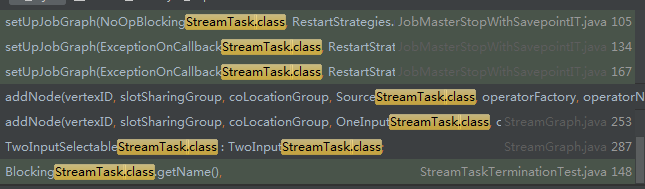
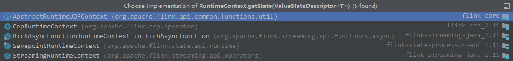

# statebackend是如何从配置中创建的

### winodw state

我们知道flink window内部元素是存储在state里的

那我们先看看window是如何创建state的，再以此为线索看看statebackend是如何创建的

- WindowOperator.java

```java
public void open() throws Exception {
		super.open();

		this.numLateRecordsDropped = metrics.counter(LATE_ELEMENTS_DROPPED_METRIC_NAME);
		timestampedCollector = new TimestampedCollector<>(output);

		internalTimerService =
				getInternalTimerService("window-timers", windowSerializer, this);

		triggerContext = new Context(null, null);
		processContext = new WindowContext(null);

		windowAssignerContext = new WindowAssigner.WindowAssignerContext() {
			@Override
			public long getCurrentProcessingTime() {
				return internalTimerService.currentProcessingTime();
			}
		};

		// create (or restore) the state that hold the actual window contents
		// NOTE - the state may be null in the case of the overriding evicting window operator
		if (windowStateDescriptor != null) {
            //这一步创建windowstate
			windowState = (InternalAppendingState<K, W, IN, ACC, ACC>) getOrCreateKeyedState(windowSerializer, windowStateDescriptor);
		}

		// create the typed and helper states for merging windows
		if (windowAssigner instanceof MergingWindowAssigner) {

			// store a typed reference for the state of merging windows - sanity check
			if (windowState instanceof InternalMergingState) {
				windowMergingState = (InternalMergingState<K, W, IN, ACC, ACC>) windowState;
			}
			// TODO this sanity check should be here, but is prevented by an incorrect test (pending validation)
			// TODO see WindowOperatorTest.testCleanupTimerWithEmptyFoldingStateForSessionWindows()
			// TODO activate the sanity check once resolved
//			else if (windowState != null) {
//				throw new IllegalStateException(
//						"The window uses a merging assigner, but the window state is not mergeable.");
//			}

			@SuppressWarnings("unchecked")
			final Class<Tuple2<W, W>> typedTuple = (Class<Tuple2<W, W>>) (Class<?>) Tuple2.class;

			final TupleSerializer<Tuple2<W, W>> tupleSerializer = new TupleSerializer<>(
					typedTuple,
					new TypeSerializer[] {windowSerializer, windowSerializer});

			final ListStateDescriptor<Tuple2<W, W>> mergingSetsStateDescriptor =
					new ListStateDescriptor<>("merging-window-set", tupleSerializer);

			// get the state that stores the merging sets
			mergingSetsState = (InternalListState<K, VoidNamespace, Tuple2<W, W>>)
					getOrCreateKeyedState(VoidNamespaceSerializer.INSTANCE, mergingSetsStateDescriptor);
			mergingSetsState.setCurrentNamespace(VoidNamespace.INSTANCE);
		}
	}
```

step in


- AbstractStreamOperator.java

```java
protected <N, S extends State, T> S getOrCreateKeyedState(
			TypeSerializer<N> namespaceSerializer,
			StateDescriptor<S, T> stateDescriptor) throws Exception {

		if (keyedStateStore != null) {
            //调用statebackend的getOrCreateKeyedState创建state
			return keyedStateBackend.getOrCreateKeyedState(namespaceSerializer, stateDescriptor);
		}
		else {
			throw new IllegalStateException("Cannot create partitioned state. " +
					"The keyed state backend has not been set." +
					"This indicates that the operator is not partitioned/keyed.");
		}
	}
```


step in


- AbstractKeyedStateBackend.java


```java
public <N, S extends State, V> S getOrCreateKeyedState(
			final TypeSerializer<N> namespaceSerializer,
			StateDescriptor<S, V> stateDescriptor) throws Exception {
		checkNotNull(namespaceSerializer, "Namespace serializer");
		checkNotNull(keySerializer, "State key serializer has not been configured in the config. " +
				"This operation cannot use partitioned state.");

		InternalKvState<K, ?, ?> kvState = keyValueStatesByName.get(stateDescriptor.getName());
		if (kvState == null) {
			if (!stateDescriptor.isSerializerInitialized()) {
				stateDescriptor.initializeSerializerUnlessSet(executionConfig);
			}
            //这里开始创建state,把this传入
			kvState = TtlStateFactory.createStateAndWrapWithTtlIfEnabled(
				namespaceSerializer, stateDescriptor, this, ttlTimeProvider);
			keyValueStatesByName.put(stateDescriptor.getName(), kvState);
			publishQueryableStateIfEnabled(stateDescriptor, kvState);
		}
		return (S) kvState;
	}
```


- TtlStateFactory.java


```java
public static <K, N, SV, TTLSV, S extends State, IS extends S> IS createStateAndWrapWithTtlIfEnabled(
		TypeSerializer<N> namespaceSerializer,
		StateDescriptor<S, SV> stateDesc,
		KeyedStateBackend<K> stateBackend,
		TtlTimeProvider timeProvider) throws Exception {
		Preconditions.checkNotNull(namespaceSerializer);
		Preconditions.checkNotNull(stateDesc);
		Preconditions.checkNotNull(stateBackend);
		Preconditions.checkNotNull(timeProvider);
		return  stateDesc.getTtlConfig().isEnabled() ?
			new TtlStateFactory<K, N, SV, TTLSV, S, IS>(
				namespaceSerializer, stateDesc, stateBackend, timeProvider)
				.createState() :
    		//如果没有enable ttl，调用各个StateBackend的抽象方法createInternalState
    		//每一种keyedstatebackend实现自己的createInternalState创建keyedstate
			stateBackend.createInternalState(namespaceSerializer, stateDesc);
	}

```

所以说winodwstate是通过statebackend来创建的


 

#### statebackend 哪里来？


- AbstractStreamOperator.java

```java
@Override
	public final void initializeState() throws Exception {

		final TypeSerializer<?> keySerializer = config.getStateKeySerializer(getUserCodeClassloader());

		final StreamTask<?, ?> containingTask =
			Preconditions.checkNotNull(getContainingTask());
		final CloseableRegistry streamTaskCloseableRegistry =
			Preconditions.checkNotNull(containingTask.getCancelables());
        //调用StreamTask的createStreamTaskStateInitializer获取初始化器
		final StreamTaskStateInitializer streamTaskStateManager =			Preconditions.checkNotNull(containingTask.createStreamTaskStateInitializer());
		//获取context
		final StreamOperatorStateContext context =
			streamTaskStateManager.streamOperatorStateContext(
				getOperatorID(),
				getClass().getSimpleName(),
				this,
				keySerializer,
				streamTaskCloseableRegistry,
				metrics);

		this.operatorStateBackend = context.operatorStateBackend();
        //从context获取keyedstatebackend
		this.keyedStateBackend = context.keyedStateBackend();

		if (keyedStateBackend != null) {
			this.keyedStateStore = new DefaultKeyedStateStore(keyedStateBackend, getExecutionConfig());
		}

		timeServiceManager = context.internalTimerServiceManager();

		CloseableIterable<KeyGroupStatePartitionStreamProvider> keyedStateInputs = context.rawKeyedStateInputs();
		CloseableIterable<StatePartitionStreamProvider> operatorStateInputs = context.rawOperatorStateInputs();

		try {
			StateInitializationContext initializationContext = new StateInitializationContextImpl(
				context.isRestored(), // information whether we restore or start for the first time
				operatorStateBackend, // access to operator state backend
				keyedStateStore, // access to keyed state backend
				keyedStateInputs, // access to keyed state stream
				operatorStateInputs); // access to operator state stream

			initializeState(initializationContext);
		} finally {
			closeFromRegistry(operatorStateInputs, streamTaskCloseableRegistry);
			closeFromRegistry(keyedStateInputs, streamTaskCloseableRegistry);
		}
	}
```

##### context怎么获取， 里面keyedstatebackend哪里来的？

- StreamTaskStateInitializerImpl.java

```java
@Override
	public StreamOperatorStateContext streamOperatorStateContext(
		@Nonnull OperatorID operatorID,
		@Nonnull String operatorClassName,
		@Nonnull KeyContext keyContext,
		@Nullable TypeSerializer<?> keySerializer,
		@Nonnull CloseableRegistry streamTaskCloseableRegistry,
		@Nonnull MetricGroup metricGroup) throws Exception {

		TaskInfo taskInfo = environment.getTaskInfo();
		OperatorSubtaskDescriptionText operatorSubtaskDescription =
			new OperatorSubtaskDescriptionText(
				operatorID,
				operatorClassName,
				taskInfo.getIndexOfThisSubtask(),
				taskInfo.getNumberOfParallelSubtasks());

		final String operatorIdentifierText = operatorSubtaskDescription.toString();

		final PrioritizedOperatorSubtaskState prioritizedOperatorSubtaskStates =
			taskStateManager.prioritizedOperatorState(operatorID);

		AbstractKeyedStateBackend<?> keyedStatedBackend = null;
		OperatorStateBackend operatorStateBackend = null;
		CloseableIterable<KeyGroupStatePartitionStreamProvider> rawKeyedStateInputs = null;
		CloseableIterable<StatePartitionStreamProvider> rawOperatorStateInputs = null;
		InternalTimeServiceManager<?> timeServiceManager;

		try {

			// -------------- Keyed State Backend --------------
            //在这里创建keyedstatebackend
			keyedStatedBackend = keyedStatedBackend(
				keySerializer,
				operatorIdentifierText,
				prioritizedOperatorSubtaskStates,
				streamTaskCloseableRegistry,
				metricGroup);

			// -------------- Operator State Backend --------------
			operatorStateBackend = operatorStateBackend(
				operatorIdentifierText,
				prioritizedOperatorSubtaskStates,
				streamTaskCloseableRegistry);

			// -------------- Raw State Streams --------------
			rawKeyedStateInputs = rawKeyedStateInputs(
				prioritizedOperatorSubtaskStates.getPrioritizedRawKeyedState().iterator());
			streamTaskCloseableRegistry.registerCloseable(rawKeyedStateInputs);

			rawOperatorStateInputs = rawOperatorStateInputs(
				prioritizedOperatorSubtaskStates.getPrioritizedRawOperatorState().iterator());
			streamTaskCloseableRegistry.registerCloseable(rawOperatorStateInputs);

			// -------------- Internal Timer Service Manager --------------
			timeServiceManager = internalTimeServiceManager(keyedStatedBackend, keyContext, rawKeyedStateInputs);

			// -------------- Preparing return value --------------
			//实际返回的context
			return new StreamOperatorStateContextImpl(
				prioritizedOperatorSubtaskStates.isRestored(),
				operatorStateBackend,
				keyedStatedBackend,
				timeServiceManager,
				rawOperatorStateInputs,
				rawKeyedStateInputs);
		} catch (Exception ex) {

			// cleanup if something went wrong before results got published.
			if (keyedStatedBackend != null) {
				if (streamTaskCloseableRegistry.unregisterCloseable(keyedStatedBackend)) {
					IOUtils.closeQuietly(keyedStatedBackend);
				}
				// release resource (e.g native resource)
				keyedStatedBackend.dispose();
			}

			if (operatorStateBackend != null) {
				if (streamTaskCloseableRegistry.unregisterCloseable(operatorStateBackend)) {
					IOUtils.closeQuietly(operatorStateBackend);
				}
				operatorStateBackend.dispose();
			}

			if (streamTaskCloseableRegistry.unregisterCloseable(rawKeyedStateInputs)) {
				IOUtils.closeQuietly(rawKeyedStateInputs);
			}

			if (streamTaskCloseableRegistry.unregisterCloseable(rawOperatorStateInputs)) {
				IOUtils.closeQuietly(rawOperatorStateInputs);
			}

			throw new Exception("Exception while creating StreamOperatorStateContext.", ex);
		}
	}
```


###### keyedStatedBackend方法内部实现

```java
protected <K> AbstractKeyedStateBackend<K> keyedStatedBackend(
		TypeSerializer<K> keySerializer,
		String operatorIdentifierText,
		PrioritizedOperatorSubtaskState prioritizedOperatorSubtaskStates,
		CloseableRegistry backendCloseableRegistry,
		MetricGroup metricGroup) throws Exception {

		if (keySerializer == null) {
			return null;
		}

		String logDescription = "keyed state backend for " + operatorIdentifierText;

		TaskInfo taskInfo = environment.getTaskInfo();

		final KeyGroupRange keyGroupRange = KeyGroupRangeAssignment.computeKeyGroupRangeForOperatorIndex(
			taskInfo.getMaxNumberOfParallelSubtasks(),
			taskInfo.getNumberOfParallelSubtasks(),
			taskInfo.getIndexOfThisSubtask());

		// Now restore processing is included in backend building/constructing process, so we need to make sure
		// each stream constructed in restore could also be closed in case of task cancel, for example the data
		// input stream opened for serDe during restore.
		CloseableRegistry cancelStreamRegistryForRestore = new CloseableRegistry();
		backendCloseableRegistry.registerCloseable(cancelStreamRegistryForRestore);
		BackendRestorerProcedure<AbstractKeyedStateBackend<K>, KeyedStateHandle> backendRestorer =
            //lambada表达式传给BackendRestorerProcedure
			new BackendRestorerProcedure<>(
				(stateHandles) -> stateBackend.createKeyedStateBackend(
					environment,
					environment.getJobID(),
					operatorIdentifierText,
					keySerializer,
					taskInfo.getMaxNumberOfParallelSubtasks(),
					keyGroupRange,
					environment.getTaskKvStateRegistry(),
					TtlTimeProvider.DEFAULT,
					metricGroup,
					stateHandles,
					cancelStreamRegistryForRestore),
				backendCloseableRegistry,
				logDescription);

		try {
            //在这里返回keyedstatebackend
			return backendRestorer.createAndRestore(
				prioritizedOperatorSubtaskStates.getPrioritizedManagedKeyedState());
		} finally {
			if (backendCloseableRegistry.unregisterCloseable(cancelStreamRegistryForRestore)) {
				IOUtils.closeQuietly(cancelStreamRegistryForRestore);
			}
		}
	}
```

到这里可以知道BackendRestorerProcedure这个类可以用来生产我们需要的keyedstatebackend，有几个个问题：

- 那个lambda传给他做什么？
- lambda什么时候调用？
- 内部如何生成keyedstatebackend？


```java
public BackendRestorerProcedure(
    	//第一个参数是FunctionWithException类型，上面的lambda就是作为这个参数传进来
		@Nonnull FunctionWithException<Collection<S>, T, Exception> instanceSupplier,
		@Nonnull CloseableRegistry backendCloseableRegistry,
		@Nonnull String logDescription) {
		//赋值给了成员instanceSupplier
		this.instanceSupplier = Preconditions.checkNotNull(instanceSupplier);
		this.backendCloseableRegistry = Preconditions.checkNotNull(backendCloseableRegistry);
		this.logDescription = logDescription;
	}
```

看一下它生成keyedstatebackend的实现`createAndRestore` 方法


```java
public T createAndRestore(@Nonnull List<? extends Collection<S>> restoreOptions) throws Exception {

		if (restoreOptions.isEmpty()) {
			restoreOptions = Collections.singletonList(Collections.emptyList());
		}

		int alternativeIdx = 0;

		Exception collectedException = null;

		while (alternativeIdx < restoreOptions.size()) {

			Collection<S> restoreState = restoreOptions.get(alternativeIdx);

			++alternativeIdx;

			// IMPORTANT: please be careful when modifying the log statements because they are used for validation in
			// the automatic end-to-end tests. Those tests might fail if they are not aligned with the log message!
			if (restoreState.isEmpty()) {
				LOG.debug("Creating {} with empty state.", logDescription);
			} else {
				if (LOG.isTraceEnabled()) {
					LOG.trace("Creating {} and restoring with state {} from alternative ({}/{}).",
						logDescription, restoreState, alternativeIdx, restoreOptions.size());
				} else {
					LOG.debug("Creating {} and restoring with state from alternative ({}/{}).",
						logDescription, alternativeIdx, restoreOptions.size());
				}
			}

			try {
                //在这里生成keyedstatebackend
				return attemptCreateAndRestore(restoreState);
			} catch (Exception ex) {

				collectedException = ExceptionUtils.firstOrSuppressed(ex, collectedException);

				LOG.warn("Exception while restoring {} from alternative ({}/{}), will retry while more " +
					"alternatives are available.", logDescription, alternativeIdx, restoreOptions.size(), ex);

				if (backendCloseableRegistry.isClosed()) {
					throw new FlinkException("Stopping restore attempts for already cancelled task.", collectedException);
				}
			}
		}

		throw new FlinkException("Could not restore " + logDescription + " from any of the " + restoreOptions.size() +
			" provided restore options.", collectedException);
	}
```


```java
private T attemptCreateAndRestore(Collection<S> restoreState) throws Exception {

		// create a new backend with necessary initialization.
    	//调用了instanceSupplier.apply方法，之前传入的lambda就在这里被调用
		final T backendInstance = instanceSupplier.apply(restoreState);

		try {
			// register the backend with the registry to participate in task lifecycle w.r.t. cancellation.
			backendCloseableRegistry.registerCloseable(backendInstance);
			return backendInstance;
		} catch (Exception ex) {
			// dispose the backend, e.g. to release native resources, if failed to register it into registry.
			try {
				backendInstance.dispose();
			} catch (Exception disposeEx) {
				ex = ExceptionUtils.firstOrSuppressed(disposeEx, ex);
			}

			throw ex;
		}
	}
```

我们看到最终是调用我们传入的lambda来生成keyedstatebackend，在来看看刚刚的lambda

```java
(stateHandles) -> stateBackend.createKeyedStateBackend(
					environment,
					environment.getJobID(),
					operatorIdentifierText,
					keySerializer,
					taskInfo.getMaxNumberOfParallelSubtasks(),
					keyGroupRange,
					environment.getTaskKvStateRegistry(),
					TtlTimeProvider.DEFAULT,
					metricGroup,
					stateHandles,
					cancelStreamRegistryForRestore),
				backendCloseableRegistry,
				logDescription);
```

调用stateBackend.createKeyedStateBackend，那么stateBackend哪里来的？


在StreamTaskStateInitializerImpl的构造函数中得到的，

```java
public StreamTaskStateInitializerImpl(
		Environment environment,
		StateBackend stateBackend,
		ProcessingTimeService processingTimeService) {

		this.environment = environment;
		this.taskStateManager = Preconditions.checkNotNull(environment.getTaskStateManager());
		this.stateBackend = Preconditions.checkNotNull(stateBackend);
		this.processingTimeService = processingTimeService;
	}
```

这个构造在哪里调用？

- StreamTask.java

  在StreamTask中createStreamTaskStateInitializer方法中

```java
public StreamTaskStateInitializer createStreamTaskStateInitializer() {
		return new StreamTaskStateInitializerImpl(
			getEnvironment(),
			stateBackend,
			timerService);
	}
```

这个方法里的statebackend哪里来

在invoke方法中调用createStateBackend

```java
public final void invoke() throws Exception {

		boolean disposed = false;
		try {
			// -------- Initialize ---------
			LOG.debug("Initializing {}.", getName());

			asyncOperationsThreadPool = Executors.newCachedThreadPool(new ExecutorThreadFactory("AsyncOperations", uncaughtExceptionHandler));

			CheckpointExceptionHandlerFactory cpExceptionHandlerFactory = createCheckpointExceptionHandlerFactory();

			checkpointExceptionHandler = cpExceptionHandlerFactory
				.createCheckpointExceptionHandler(getEnvironment());
			//调用createStateBackend创建statebackend
			stateBackend = createStateBackend();
			checkpointStorage = stateBackend.createCheckpointStorage(getEnvironment().getJobID());

			// if the clock is not already set, then assign a default TimeServiceProvider
			if (timerService == null) {
				ThreadFactory timerThreadFactory = new DispatcherThreadFactory(TRIGGER_THREAD_GROUP,
					"Time Trigger for " + getName(), getUserCodeClassLoader());

				timerService = new SystemProcessingTimeService(this, getCheckpointLock(), timerThreadFactory);
			}

			operatorChain = new OperatorChain<>(this, recordWriters);
			headOperator = operatorChain.getHeadOperator();

			// task specific initialization
			init();

			// save the work of reloading state, etc, if the task is already canceled
			if (canceled) {
				throw new CancelTaskException();
			}

			// -------- Invoke --------
			LOG.debug("Invoking {}", getName());

			// we need to make sure that any triggers scheduled in open() cannot be
			// executed before all operators are opened
			synchronized (lock) {

				// both the following operations are protected by the lock
				// so that we avoid race conditions in the case that initializeState()
				// registers a timer, that fires before the open() is called.

				initializeState();
				openAllOperators();
			}

			// final check to exit early before starting to run
			if (canceled) {
				throw new CancelTaskException();
			}

			// let the task do its work
			isRunning = true;
			run();

			// if this left the run() method cleanly despite the fact that this was canceled,
			// make sure the "clean shutdown" is not attempted
			if (canceled) {
				throw new CancelTaskException();
			}

			LOG.debug("Finished task {}", getName());

			// make sure no further checkpoint and notification actions happen.
			// we make sure that no other thread is currently in the locked scope before
			// we close the operators by trying to acquire the checkpoint scope lock
			// we also need to make sure that no triggers fire concurrently with the close logic
			// at the same time, this makes sure that during any "regular" exit where still
			synchronized (lock) {
				// this is part of the main logic, so if this fails, the task is considered failed
				closeAllOperators();

				// make sure no new timers can come
				timerService.quiesce();

				// only set the StreamTask to not running after all operators have been closed!
				// See FLINK-7430
				isRunning = false;
			}

			// make sure all timers finish
			timerService.awaitPendingAfterQuiesce();

			LOG.debug("Closed operators for task {}", getName());

			// make sure all buffered data is flushed
			operatorChain.flushOutputs();

			// make an attempt to dispose the operators such that failures in the dispose call
			// still let the computation fail
			tryDisposeAllOperators();
			disposed = true;
		}
		finally {
			// clean up everything we initialized
			isRunning = false;

			// Now that we are outside the user code, we do not want to be interrupted further
			// upon cancellation. The shutdown logic below needs to make sure it does not issue calls
			// that block and stall shutdown.
			// Additionally, the cancellation watch dog will issue a hard-cancel (kill the TaskManager
			// process) as a backup in case some shutdown procedure blocks outside our control.
			setShouldInterruptOnCancel(false);

			// clear any previously issued interrupt for a more graceful shutdown
			Thread.interrupted();

			// stop all timers and threads
			tryShutdownTimerService();

			// stop all asynchronous checkpoint threads
			try {
				cancelables.close();
				shutdownAsyncThreads();
			}
			catch (Throwable t) {
				// catch and log the exception to not replace the original exception
				LOG.error("Could not shut down async checkpoint threads", t);
			}

			// we must! perform this cleanup
			try {
				cleanup();
			}
			catch (Throwable t) {
				// catch and log the exception to not replace the original exception
				LOG.error("Error during cleanup of stream task", t);
			}

			// if the operators were not disposed before, do a hard dispose
			if (!disposed) {
				disposeAllOperators();
			}

			// release the output resources. this method should never fail.
			if (operatorChain != null) {
				// beware: without synchronization, #performCheckpoint() may run in
				//         parallel and this call is not thread-safe
				synchronized (lock) {
					operatorChain.releaseOutputs();
				}
			}
		}
	}
```


看看createStateBackend的代码

```java
private StateBackend createStateBackend() throws Exception {
		final StateBackend fromApplication = configuration.getStateBackend(getUserCodeClassLoader());
		//从配置中创建
		return StateBackendLoader.fromApplicationOrConfigOrDefault(
				fromApplication,
				getEnvironment().getTaskManagerInfo().getConfiguration(),
				getUserCodeClassLoader(),
				LOG);
	}
```

最终看到是从配置中创建statebackend

```java
public static StateBackend fromApplicationOrConfigOrDefault(
			@Nullable StateBackend fromApplication,
			Configuration config,
			ClassLoader classLoader,
			@Nullable Logger logger) throws IllegalConfigurationException, DynamicCodeLoadingException, IOException {

		checkNotNull(config, "config");
		checkNotNull(classLoader, "classLoader");

		final StateBackend backend;

		// (1) the application defined state backend has precedence
    	//代码里配置
		if (fromApplication != null) {
			if (logger != null) {
				logger.info("Using application-defined state backend: {}", fromApplication);
			}

			// see if this is supposed to pick up additional configuration parameters
			if (fromApplication instanceof ConfigurableStateBackend) {
				// needs to pick up configuration
				if (logger != null) {
					logger.info("Configuring application-defined state backend with job/cluster config");
				}

				backend = ((ConfigurableStateBackend) fromApplication).configure(config, classLoader);
			}
			else {
				// keep as is!
				backend = fromApplication;
			}
		}
		else {
			// (2) check if the config defines a state backend
            //配置文件里state.backend读到
			final StateBackend fromConfig = loadStateBackendFromConfig(config, classLoader, logger);
			if (fromConfig != null) {
				backend = fromConfig;
			}
			else {
				// (3) use the default
                //默认MemoryStateBackendFactory
				backend = new MemoryStateBackendFactory().createFromConfig(config, classLoader);
				if (logger != null) {
					logger.info("No state backend has been configured, using default (Memory / JobManager) {}", backend);
				}
			}
		}

		return backend;
	}
```


这个方法中的`config`是从`environment`拿到的，那`environment`是如何得到的

## fromApplicationOrConfigOrDefault中的参数config从哪里来

找一下是`StreamTask`的构造方法传进来的

```java
protected StreamTask(Environment env) {
		this(env, null);
	}
```

这个构造是哪里调用呢， 仔细找一下发现没有地方引用

尝试查一下类的引用，发现在`StreamGraph`确实有引用到`SourceStreamTask`, `OneInputStreamTask`, `TwoInputStreamTask`, 他们是`StreamTask`的子类




我们随便进去一个看看

- StreamGraph.java

```java
public <IN, OUT> void addOperator(
			Integer vertexID,
			@Nullable String slotSharingGroup,
			@Nullable String coLocationGroup,
			StreamOperatorFactory<OUT> operatorFactory,
			TypeInformation<IN> inTypeInfo,
			TypeInformation<OUT> outTypeInfo,
			String operatorName) {

		if (operatorFactory.isStreamSource()) {
            //在这里引用了SourceStreamTask
			addNode(vertexID, slotSharingGroup, coLocationGroup, SourceStreamTask.class, operatorFactory, operatorName);
		} else {
			addNode(vertexID, slotSharingGroup, coLocationGroup, OneInputStreamTask.class, operatorFactory, operatorName);
		}

		TypeSerializer<IN> inSerializer = inTypeInfo != null && !(inTypeInfo instanceof MissingTypeInfo) ? inTypeInfo.createSerializer(executionConfig) : null;

		TypeSerializer<OUT> outSerializer = outTypeInfo != null && !(outTypeInfo instanceof MissingTypeInfo) ? outTypeInfo.createSerializer(executionConfig) : null;

		setSerializers(vertexID, inSerializer, null, outSerializer);

		if (operatorFactory.isOutputTypeConfigurable() && outTypeInfo != null) {
			// sets the output type which must be know at StreamGraph creation time
			operatorFactory.setOutputType(outTypeInfo, executionConfig);
		}

		if (operatorFactory.isInputTypeConfigurable()) {
			operatorFactory.setInputType(inTypeInfo, executionConfig);
		}

		if (LOG.isDebugEnabled()) {
			LOG.debug("Vertex: {}", vertexID);
		}
	}
```

显然这是从job代码生成`StreamGraph`的过程中，

step in

```java
protected StreamNode addNode(Integer vertexID,
		@Nullable String slotSharingGroup,
		@Nullable String coLocationGroup,
		Class<? extends AbstractInvokable> vertexClass,
		StreamOperatorFactory<?> operatorFactory,
		String operatorName) {

		if (streamNodes.containsKey(vertexID)) {
			throw new RuntimeException("Duplicate vertexID " + vertexID);
		}
		//生成一个StreamNode
		StreamNode vertex = new StreamNode(
			vertexID,
			slotSharingGroup,
			coLocationGroup,
			operatorFactory,
			operatorName,
			new ArrayList<OutputSelector<?>>(),
            //最后一个参数是我们上层传的SourceStreamTask.class
			vertexClass);
		//放到map里面
		streamNodes.put(vertexID, vertex);

		return vertex;
	}
```

step in

- StreamNode.class

```java
public StreamNode(
		Integer id,
		@Nullable String slotSharingGroup,
		@Nullable String coLocationGroup,
		StreamOperatorFactory<?> operatorFactory,
		String operatorName,
		List<OutputSelector<?>> outputSelector,
		Class<? extends AbstractInvokable> jobVertexClass) {

		this.id = id;
		this.operatorName = operatorName;
		this.operatorFactory = operatorFactory;
		this.outputSelectors = outputSelector;
    	//传给了这个成员变量
		this.jobVertexClass = jobVertexClass;
		this.slotSharingGroup = slotSharingGroup;
		this.coLocationGroup = coLocationGroup;
	}
```


查看一下这个成员引用，有个get方法

```java
public Class<? extends AbstractInvokable> getJobVertexClass() {
		return jobVertexClass;
	}
```

查一下这个方法引用

- StreamingJobGraphGenerator.java

```java
private StreamConfig createJobVertex(
			Integer streamNodeId,
			Map<Integer, byte[]> hashes,
			List<Map<Integer, byte[]>> legacyHashes,
			Map<Integer, List<Tuple2<byte[], byte[]>>> chainedOperatorHashes) {

		JobVertex jobVertex;
		StreamNode streamNode = streamGraph.getStreamNode(streamNodeId);

		byte[] hash = hashes.get(streamNodeId);

		if (hash == null) {
			throw new IllegalStateException("Cannot find node hash. " +
					"Did you generate them before calling this method?");
		}

		JobVertexID jobVertexId = new JobVertexID(hash);

		List<JobVertexID> legacyJobVertexIds = new ArrayList<>(legacyHashes.size());
		for (Map<Integer, byte[]> legacyHash : legacyHashes) {
			hash = legacyHash.get(streamNodeId);
			if (null != hash) {
				legacyJobVertexIds.add(new JobVertexID(hash));
			}
		}

		List<Tuple2<byte[], byte[]>> chainedOperators = chainedOperatorHashes.get(streamNodeId);
		List<OperatorID> chainedOperatorVertexIds = new ArrayList<>();
		List<OperatorID> userDefinedChainedOperatorVertexIds = new ArrayList<>();
		if (chainedOperators != null) {
			for (Tuple2<byte[], byte[]> chainedOperator : chainedOperators) {
				chainedOperatorVertexIds.add(new OperatorID(chainedOperator.f0));
				userDefinedChainedOperatorVertexIds.add(chainedOperator.f1 != null ? new OperatorID(chainedOperator.f1) : null);
			}
		}

		if (chainedInputOutputFormats.containsKey(streamNodeId)) {
			jobVertex = new InputOutputFormatVertex(
					chainedNames.get(streamNodeId),
					jobVertexId,
					legacyJobVertexIds,
					chainedOperatorVertexIds,
					userDefinedChainedOperatorVertexIds);

			chainedInputOutputFormats
				.get(streamNodeId)
				.write(new TaskConfig(jobVertex.getConfiguration()));
		} else {
			jobVertex = new JobVertex(
					chainedNames.get(streamNodeId),
					jobVertexId,
					legacyJobVertexIds,
					chainedOperatorVertexIds,
					userDefinedChainedOperatorVertexIds);
		}

		jobVertex.setResources(chainedMinResources.get(streamNodeId), chainedPreferredResources.get(streamNodeId));
		//这里引用, 里面还有一个getInvokableClass, 这里暂时不研究
		jobVertex.setInvokableClass(streamNode.getJobVertexClass());

		int parallelism = streamNode.getParallelism();

		if (parallelism > 0) {
			jobVertex.setParallelism(parallelism);
		} else {
			parallelism = jobVertex.getParallelism();
		}
		
		jobVertex.setMaxParallelism(streamNode.getMaxParallelism());

		if (LOG.isDebugEnabled()) {
			LOG.debug("Parallelism set: {} for {}", parallelism, streamNodeId);
		}

		// TODO: inherit InputDependencyConstraint from the head operator
		jobVertex.setInputDependencyConstraint(streamGraph.getExecutionConfig().getDefaultInputDependencyConstraint());

		jobVertices.put(streamNodeId, jobVertex);
		builtVertices.add(streamNodeId);
		jobGraph.addVertex(jobVertex);

		return new StreamConfig(jobVertex.getConfiguration());
	}
```

由这个方法我们一路往前查引用的地方，看看会到哪

```java
private List<StreamEdge> createChain(
			Integer startNodeId,
			Integer currentNodeId,
			Map<Integer, byte[]> hashes,
			List<Map<Integer, byte[]>> legacyHashes,
			int chainIndex,
			Map<Integer, List<Tuple2<byte[], byte[]>>> chainedOperatorHashes) {

		if (!builtVertices.contains(startNodeId)) {

			List<StreamEdge> transitiveOutEdges = new ArrayList<StreamEdge>();

			List<StreamEdge> chainableOutputs = new ArrayList<StreamEdge>();
			List<StreamEdge> nonChainableOutputs = new ArrayList<StreamEdge>();

			StreamNode currentNode = streamGraph.getStreamNode(currentNodeId);

			for (StreamEdge outEdge : currentNode.getOutEdges()) {
				if (isChainable(outEdge, streamGraph)) {
					chainableOutputs.add(outEdge);
				} else {
					nonChainableOutputs.add(outEdge);
				}
			}

			for (StreamEdge chainable : chainableOutputs) {
				transitiveOutEdges.addAll(
						createChain(startNodeId, chainable.getTargetId(), hashes, legacyHashes, chainIndex + 1, chainedOperatorHashes));
			}

			for (StreamEdge nonChainable : nonChainableOutputs) {
				transitiveOutEdges.add(nonChainable);
				createChain(nonChainable.getTargetId(), nonChainable.getTargetId(), hashes, legacyHashes, 0, chainedOperatorHashes);
			}

			List<Tuple2<byte[], byte[]>> operatorHashes =
				chainedOperatorHashes.computeIfAbsent(startNodeId, k -> new ArrayList<>());

			byte[] primaryHashBytes = hashes.get(currentNodeId);
			OperatorID currentOperatorId = new OperatorID(primaryHashBytes);

			for (Map<Integer, byte[]> legacyHash : legacyHashes) {
				operatorHashes.add(new Tuple2<>(primaryHashBytes, legacyHash.get(currentNodeId)));
			}

			chainedNames.put(currentNodeId, createChainedName(currentNodeId, chainableOutputs));
			chainedMinResources.put(currentNodeId, createChainedMinResources(currentNodeId, chainableOutputs));
			chainedPreferredResources.put(currentNodeId, createChainedPreferredResources(currentNodeId, chainableOutputs));

			if (currentNode.getInputFormat() != null) {
				getOrCreateFormatContainer(startNodeId).addInputFormat(currentOperatorId, currentNode.getInputFormat());
			}

			if (currentNode.getOutputFormat() != null) {
				getOrCreateFormatContainer(startNodeId).addOutputFormat(currentOperatorId, currentNode.getOutputFormat());
			}

			StreamConfig config = currentNodeId.equals(startNodeId)
					? createJobVertex(startNodeId, hashes, legacyHashes, chainedOperatorHashes)
					: new StreamConfig(new Configuration());

			setVertexConfig(currentNodeId, config, chainableOutputs, nonChainableOutputs);

			if (currentNodeId.equals(startNodeId)) {

				config.setChainStart();
				config.setChainIndex(0);
				config.setOperatorName(streamGraph.getStreamNode(currentNodeId).getOperatorName());
				config.setOutEdgesInOrder(transitiveOutEdges);
				config.setOutEdges(streamGraph.getStreamNode(currentNodeId).getOutEdges());

				for (StreamEdge edge : transitiveOutEdges) {
					connect(startNodeId, edge);
				}

				config.setTransitiveChainedTaskConfigs(chainedConfigs.get(startNodeId));

			} else {
				chainedConfigs.computeIfAbsent(startNodeId, k -> new HashMap<Integer, StreamConfig>());

				config.setChainIndex(chainIndex);
				StreamNode node = streamGraph.getStreamNode(currentNodeId);
				config.setOperatorName(node.getOperatorName());
				chainedConfigs.get(startNodeId).put(currentNodeId, config);
			}

			config.setOperatorID(currentOperatorId);

			if (chainableOutputs.isEmpty()) {
				config.setChainEnd();
			}
			return transitiveOutEdges;

		} else {
			return new ArrayList<>();
		}
	}
```


```java
private void setChaining(Map<Integer, byte[]> hashes, List<Map<Integer, byte[]>> legacyHashes, Map<Integer, List<Tuple2<byte[], byte[]>>> chainedOperatorHashes) {
		for (Integer sourceNodeId : streamGraph.getSourceIDs()) {
			createChain(sourceNodeId, sourceNodeId, hashes, legacyHashes, 0, chainedOperatorHashes);
		}
	}
```


```java
private JobGraph createJobGraph() {

		// make sure that all vertices start immediately
		jobGraph.setScheduleMode(streamGraph.getScheduleMode());

		// Generate deterministic hashes for the nodes in order to identify them across
		// submission iff they didn't change.
		Map<Integer, byte[]> hashes = defaultStreamGraphHasher.traverseStreamGraphAndGenerateHashes(streamGraph);

		// Generate legacy version hashes for backwards compatibility
		List<Map<Integer, byte[]>> legacyHashes = new ArrayList<>(legacyStreamGraphHashers.size());
		for (StreamGraphHasher hasher : legacyStreamGraphHashers) {
			legacyHashes.add(hasher.traverseStreamGraphAndGenerateHashes(streamGraph));
		}

		Map<Integer, List<Tuple2<byte[], byte[]>>> chainedOperatorHashes = new HashMap<>();

		setChaining(hashes, legacyHashes, chainedOperatorHashes);

		setPhysicalEdges();

		setSlotSharingAndCoLocation();

		configureCheckpointing();

		JobGraphGenerator.addUserArtifactEntries(streamGraph.getUserArtifacts(), jobGraph);

		// set the ExecutionConfig last when it has been finalized
		try {
			jobGraph.setExecutionConfig(streamGraph.getExecutionConfig());
		}
		catch (IOException e) {
			throw new IllegalConfigurationException("Could not serialize the ExecutionConfig." +
					"This indicates that non-serializable types (like custom serializers) were registered");
		}

		return jobGraph;
	}
```


```java
public static JobGraph createJobGraph(StreamGraph streamGraph, @Nullable JobID jobID) {
		return new StreamingJobGraphGenerator(streamGraph, jobID).createJobGraph();
	}
```


- StreamGraph.java

```java
public JobGraph getJobGraph(@Nullable JobID jobID) {
		// temporarily forbid checkpointing for iterative jobs
		if (isIterative() && checkpointConfig.isCheckpointingEnabled() && !checkpointConfig.isForceCheckpointing()) {
			throw new UnsupportedOperationException(
				"Checkpointing is currently not supported by default for iterative jobs, as we cannot guarantee exactly once semantics. "
					+ "State checkpoints happen normally, but records in-transit during the snapshot will be lost upon failure. "
					+ "\nThe user can force enable state checkpoints with the reduced guarantees by calling: env.enableCheckpointing(interval,true)");
		}

		return StreamingJobGraphGenerator.createJobGraph(this, jobID);
	}
```


- StreamPlan.java

```java
public JobGraph getJobGraph() {
		return getJobGraph(null);
	}
```

- ClusterClient.java

```java
public static JobGraph getJobGraph(Configuration flinkConfig, FlinkPlan optPlan, List<URL> jarFiles, List<URL> classpaths, SavepointRestoreSettings savepointSettings) {
		JobGraph job;
		if (optPlan instanceof StreamingPlan) {
			job = ((StreamingPlan) optPlan).getJobGraph();
			job.setSavepointRestoreSettings(savepointSettings);
		} else {
			JobGraphGenerator gen = new JobGraphGenerator(flinkConfig);
			job = gen.compileJobGraph((OptimizedPlan) optPlan);
		}

		for (URL jar : jarFiles) {
			try {
				job.addJar(new Path(jar.toURI()));
			} catch (URISyntaxException e) {
				throw new RuntimeException("URL is invalid. This should not happen.", e);
			}
		}

		job.setClasspaths(classpaths);

		return job;
	}
```


```java
public JobSubmissionResult run(FlinkPlan compiledPlan,
			List<URL> libraries, List<URL> classpaths, ClassLoader classLoader, SavepointRestoreSettings savepointSettings)
			throws ProgramInvocationException {
		JobGraph job = getJobGraph(flinkConfig, compiledPlan, libraries, classpaths, savepointSettings);
		return submitJob(job, classLoader);
	}
```


```java
private static JobExecutionResult executeRemotely(StreamGraph streamGraph,
		ClassLoader envClassLoader,
		ExecutionConfig executionConfig,
		List<URL> jarFiles,
		String host,
		int port,
		Configuration clientConfiguration,
		List<URL> globalClasspaths,
		SavepointRestoreSettings savepointRestoreSettings
	) throws ProgramInvocationException {
		if (LOG.isInfoEnabled()) {
			LOG.info("Running remotely at {}:{}", host, port);
		}

		ClassLoader userCodeClassLoader = JobWithJars.buildUserCodeClassLoader(jarFiles, globalClasspaths, envClassLoader);

		Configuration configuration = new Configuration();
		configuration.addAll(clientConfiguration);

		configuration.setString(JobManagerOptions.ADDRESS, host);
		configuration.setInteger(JobManagerOptions.PORT, port);

		configuration.setInteger(RestOptions.PORT, port);

		final ClusterClient<?> client;
		try {
			client = new RestClusterClient<>(configuration, "RemoteStreamEnvironment");
		}
		catch (Exception e) {
			throw new ProgramInvocationException("Cannot establish connection to JobManager: " + e.getMessage(),
				streamGraph.getJobGraph().getJobID(), e);
		}

		client.setPrintStatusDuringExecution(executionConfig.isSysoutLoggingEnabled());

		if (savepointRestoreSettings == null) {
			savepointRestoreSettings = SavepointRestoreSettings.none();
		}

		try {
			return client.run(streamGraph, jarFiles, globalClasspaths, userCodeClassLoader, savepointRestoreSettings)
				.getJobExecutionResult();
		}
		catch (ProgramInvocationException e) {
			throw e;
		}
		catch (Exception e) {
			String term = e.getMessage() == null ? "." : (": " + e.getMessage());
			throw new ProgramInvocationException("The program execution failed" + term,
				streamGraph.getJobGraph().getJobID(), e);
		}
		finally {
			try {
				client.shutdown();
			} catch (Exception e) {
				LOG.warn("Could not properly shut down the cluster client.", e);
			}
		}
	}

```

到这里就很清楚这是调用`env.execute()`执行的地方


## 用户定义的state

我们知道，用户定义的state是从`RuntimeContext`创建的， 看看里面的实现

- RuntimeContext.java

```java
<T> ValueState<T> getState(ValueStateDescriptor<T> stateProperties);
```

它是一个接口方法，有这些实现类



`AbstractRuntimeUDFContext` 、`CepRuntimeContext` 、`RichAsyncFuntionRuntimeContext`里面只是抛异常，`SavepointRuntimeContext` 通常不怎么用到，所以我们只看`StreamingRuntimeContext`

- StreamingRuntimeContext.java

```java
public <T> ValueState<T> getState(ValueStateDescriptor<T> stateProperties) {
    	//获取keyedStateStore
		KeyedStateStore keyedStateStore = checkPreconditionsAndGetKeyedStateStore(stateProperties);
		stateProperties.initializeSerializerUnlessSet(getExecutionConfig());
    	//获取state
		return keyedStateStore.getState(stateProperties);
	}
```


我们先看看这个`KeyedStateStore`

- KeyedStateStore.java

```java
public interface KeyedStateStore 
```

发现它是个interface


那我们看看刚刚的KeyedStateStore是怎么获取的，以便确认它是什么实现类

- AbstractStreamOperator.java

```java
public final void initializeState() throws Exception {

		final TypeSerializer<?> keySerializer = config.getStateKeySerializer(getUserCodeClassloader());

		final StreamTask<?, ?> containingTask =
			Preconditions.checkNotNull(getContainingTask());
		final CloseableRegistry streamTaskCloseableRegistry =
			Preconditions.checkNotNull(containingTask.getCancelables());
		final StreamTaskStateInitializer streamTaskStateManager =
			Preconditions.checkNotNull(containingTask.createStreamTaskStateInitializer());

		final StreamOperatorStateContext context =
			streamTaskStateManager.streamOperatorStateContext(
				getOperatorID(),
				getClass().getSimpleName(),
				this,
				keySerializer,
				streamTaskCloseableRegistry,
				metrics);

		this.operatorStateBackend = context.operatorStateBackend();
		this.keyedStateBackend = context.keyedStateBackend();

		if (keyedStateBackend != null) {
            //实际上是DefaultKeyedStateStore
			this.keyedStateStore = new DefaultKeyedStateStore(keyedStateBackend, getExecutionConfig());
		}

		timeServiceManager = context.internalTimerServiceManager();

		CloseableIterable<KeyGroupStatePartitionStreamProvider> keyedStateInputs = context.rawKeyedStateInputs();
		CloseableIterable<StatePartitionStreamProvider> operatorStateInputs = context.rawOperatorStateInputs();

		try {
			StateInitializationContext initializationContext = new StateInitializationContextImpl(
				context.isRestored(), // information whether we restore or start for the first time
				operatorStateBackend, // access to operator state backend
				keyedStateStore, // access to keyed state backend
				keyedStateInputs, // access to keyed state stream
				operatorStateInputs); // access to operator state stream

			initializeState(initializationContext);
		} finally {
			closeFromRegistry(operatorStateInputs, streamTaskCloseableRegistry);
			closeFromRegistry(keyedStateInputs, streamTaskCloseableRegistry);
		}
	}
```


原来是用的`DefaultKeyedStateStore`


看看它的`getState` 方法

- DefaultKeyedStateStore.java

```java
public <T> ValueState<T> getState(ValueStateDescriptor<T> stateProperties) {
		requireNonNull(stateProperties, "The state properties must not be null");
		try {
			stateProperties.initializeSerializerUnlessSet(executionConfig);
            //调用这个
			return getPartitionedState(stateProperties);
		} catch (Exception e) {
			throw new RuntimeException("Error while getting state", e);
		}
	}

protected  <S extends State> S getPartitionedState(StateDescriptor<S, ?> stateDescriptor) throws Exception {
        //调用这个
		return keyedStateBackend.getPartitionedState(
				VoidNamespace.INSTANCE,
				VoidNamespaceSerializer.INSTANCE,
				stateDescriptor);
	}
```


- AbstractKeyedStateBackend.java

```java
	public <N, S extends State> S getPartitionedState(
			final N namespace,
			final TypeSerializer<N> namespaceSerializer,
			final StateDescriptor<S, ?> stateDescriptor) throws Exception {

		checkNotNull(namespace, "Namespace");

		if (lastName != null && lastName.equals(stateDescriptor.getName())) {
			lastState.setCurrentNamespace(namespace);
			return (S) lastState;
		}

		InternalKvState<K, ?, ?> previous = keyValueStatesByName.get(stateDescriptor.getName());
		if (previous != null) {
			lastState = previous;
			lastState.setCurrentNamespace(namespace);
			lastName = stateDescriptor.getName();
			return (S) previous;
		}
		//最终还是走到这个方法
		final S state = getOrCreateKeyedState(namespaceSerializer, stateDescriptor);
		final InternalKvState<K, N, ?> kvState = (InternalKvState<K, N, ?>) state;

		lastName = stateDescriptor.getName();
		lastState = kvState;
		kvState.setCurrentNamespace(namespace);

		return state;
	}
```

我们看到自定义的state最终也走到`getOrCreateKeyedState` 殊途同归